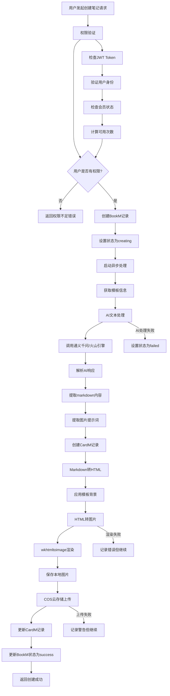
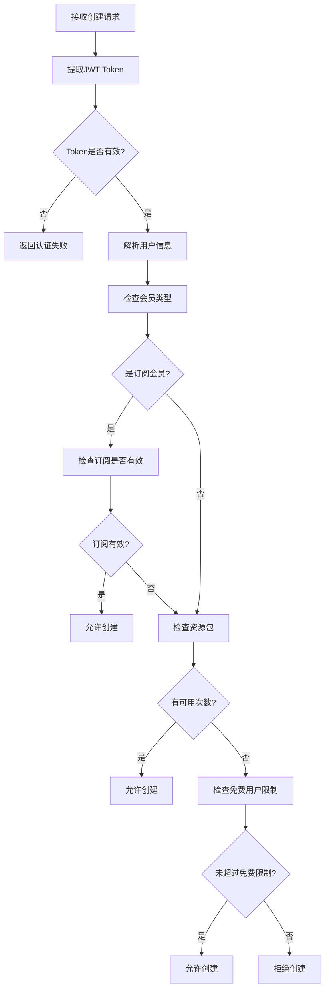
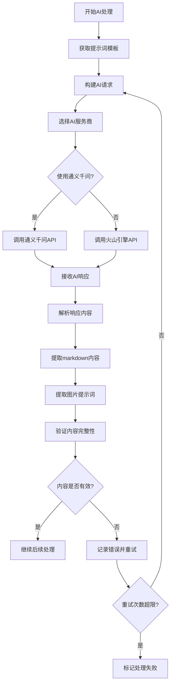
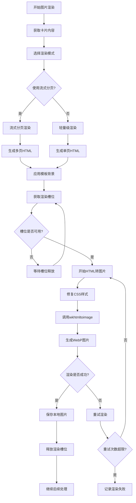
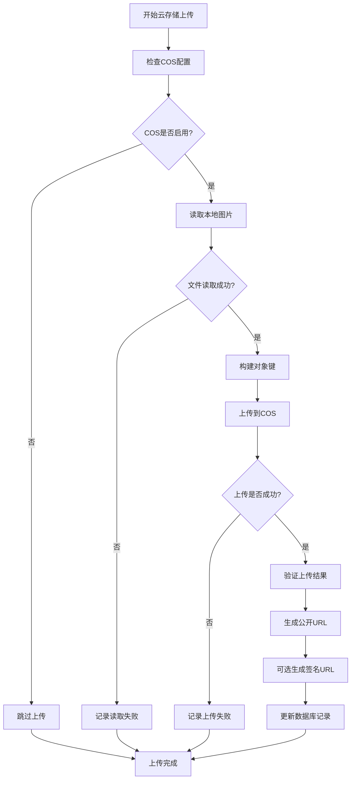
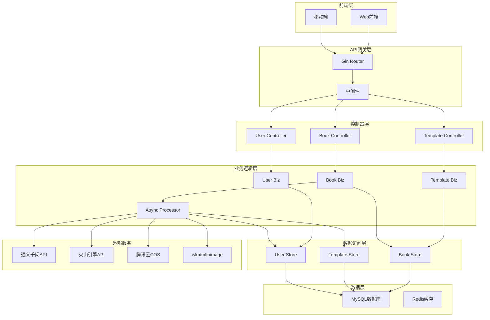
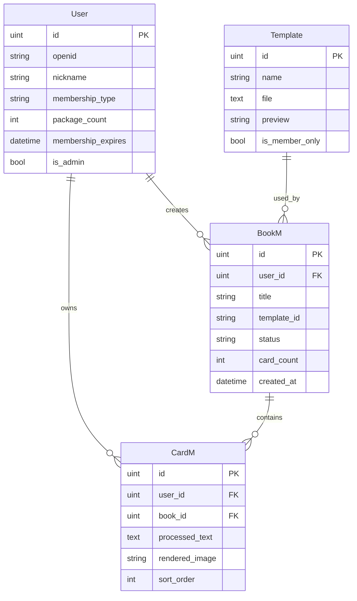

# 创建笔记流程图

## 主流程图

```mermaid
graph TD
    A[用户发起创建笔记请求] --> B[权限验证]
    B --> C{用户是否有权限?}
    C -->|否| D[返回权限不足错误]
    C -->|是| E[创建BookM记录]
    
    E --> F[设置状态为creating]
    F --> G[启动异步处理]
    G --> H[获取模板信息]
    
    H --> I[AI文本处理]
    I --> J[调用通义千问/火山引擎]
    J --> K[解析AI响应]
    K --> L[提取markdown内容]
    L --> M[提取图片提示词]
    
    M --> N[创建CardM记录]
    N --> O[Markdown转HTML]
    O --> P[应用模板背景]
    P --> Q[HTML转图片]
    
    Q --> R[wkhtmltoimage渲染]
    R --> S[保存本地图片]
    S --> T[COS云存储上传]
    T --> U[更新CardM记录]
    U --> V[更新BookM状态为success]
    
    V --> W[返回创建成功]
    
    %% 错误处理分支
    I -->|AI处理失败| X[设置状态为failed]
    Q -->|渲染失败| Y[记录错误但继续]
    T -->|上传失败| Z[记录警告但继续]
    
    %% 权限检查详细流程
    B --> B1[检查JWT Token]
    B1 --> B2[验证用户身份]
    B2 --> B3[检查会员状态]
    B3 --> B4[计算可用次数]
    B4 --> C
```

## 权限验证详细流程

```mermaid
graph TD
    A[接收创建请求] --> B[提取JWT Token]
    B --> C{Token是否有效?}
    C -->|否| D[返回认证失败]
    C -->|是| E[解析用户信息]
    
    E --> F[检查会员类型]
    F --> G{是订阅会员?}
    G -->|是| H[检查订阅是否有效]
    H --> I{订阅有效?}
    I -->|是| J[允许创建]
    I -->|否| K[检查资源包]
    
    G -->|否| K[检查资源包]
    K --> L{有可用次数?}
    L -->|是| M[允许创建]
    L -->|否| N[检查免费用户限制]
    
    N --> O{未超过免费限制?}
    O -->|是| P[允许创建]
    O -->|否| Q[拒绝创建]
```

## AI处理详细流程

```mermaid
graph TD
    A[开始AI处理] --> B[获取提示词模板]
    B --> C[构建AI请求]
    C --> D[选择AI服务商]
    
    D --> E{使用通义千问?}
    E -->|是| F[调用通义千问API]
    E -->|否| G[调用火山引擎API]
    
    F --> H[接收AI响应]
    G --> H
    H --> I[解析响应内容]
    
    I --> J[提取markdown内容]
    J --> K[提取图片提示词]
    K --> L[验证内容完整性]
    
    L --> M{内容是否有效?}
    M -->|是| N[继续后续处理]
    M -->|否| O[记录错误并重试]
    
    O --> P{重试次数超限?}
    P -->|是| Q[标记处理失败]
    P -->|否| C
```

## 图片渲染详细流程

```mermaid
graph TD
    A[开始图片渲染] --> B[获取卡片内容]
    B --> C[选择渲染模式]
    
    C --> D{使用流式分页?}
    D -->|是| E[流式分页渲染]
    D -->|否| F[轻量级渲染]
    
    E --> G[生成多页HTML]
    F --> H[生成单页HTML]
    
    G --> I[应用模板背景]
    H --> I
    
    I --> J[获取渲染槽位]
    J --> K{槽位是否可用?}
    K -->|否| L[等待槽位释放]
    L --> J
    K -->|是| M[开始HTML转图片]
    
    M --> N[修复CSS样式]
    N --> O[调用wkhtmltoimage]
    O --> P[生成WebP图片]
    
    P --> Q{渲染是否成功?}
    Q -->|是| R[保存本地图片]
    Q -->|否| S[重试渲染]
    
    S --> T{重试次数超限?}
    T -->|是| U[记录渲染失败]
    T -->|否| M
    
    R --> V[释放渲染槽位]
    V --> W[继续后续处理]
```

## 云存储上传流程

```mermaid
graph TD
    A[开始云存储上传] --> B[检查COS配置]
    B --> C{COS是否启用?}
    C -->|否| D[跳过上传]
    C -->|是| E[读取本地图片]
    
    E --> F{文件读取成功?}
    F -->|否| G[记录读取失败]
    F -->|是| H[构建对象键]
    
    H --> I[上传到COS]
    I --> J{上传是否成功?}
    J -->|否| K[记录上传失败]
    J -->|是| L[验证上传结果]
    
    L --> M[生成公开URL]
    M --> N[可选生成签名URL]
    N --> O[更新数据库记录]
    
    O --> P[上传完成]
    D --> P
    G --> P
    K --> P
```

## 系统架构图

```mermaid
graph TB
    subgraph "前端层"
        A[Web前端]
        B[移动端]
    end
    
    subgraph "API网关层"
        C[Gin Router]
        D[中间件]
    end
    
    subgraph "控制器层"
        E[Book Controller]
        F[Template Controller]
        G[User Controller]
    end
    
    subgraph "业务逻辑层"
        H[Book Biz]
        I[Template Biz]
        J[User Biz]
        K[Async Processor]
    end
    
    subgraph "数据访问层"
        L[Book Store]
        M[Template Store]
        N[User Store]
    end
    
    subgraph "数据层"
        O[MySQL数据库]
        P[Redis缓存]
    end
    
    subgraph "外部服务"
        Q[通义千问API]
        R[火山引擎API]
        S[腾讯云COS]
        T[wkhtmltoimage]
    end
    
    A --> C
    B --> C
    C --> D
    D --> E
    D --> F
    D --> G
    
    E --> H
    F --> I
    G --> J
    
    H --> K
    I --> L
    J --> N
    
    H --> L
    K --> M
    K --> N
    
    L --> O
    M --> O
    N --> O
    
    K --> Q
    K --> R
    K --> S
    K --> T
```

## 数据模型关系图

```mermaid
erDiagram
    User ||--o{ BookM : creates
    User ||--o{ CardM : owns
    BookM ||--o{ CardM : contains
    Template ||--o{ BookM : used_by
    
    User {
        uint id PK
        string openid
        string nickname
        string membership_type
        int package_count
        datetime membership_expires
        bool is_admin
    }
    
    BookM {
        uint id PK
        uint user_id FK
        string title
        string template_id
        string status
        int card_count
        datetime created_at
    }
    
    CardM {
        uint id PK
        uint user_id FK
        uint book_id FK
        text processed_text
        string rendered_image
        int sort_order
    }
    
    Template {
        uint id PK
        string name
        text file
        string preview
        bool is_member_only
    }
```
