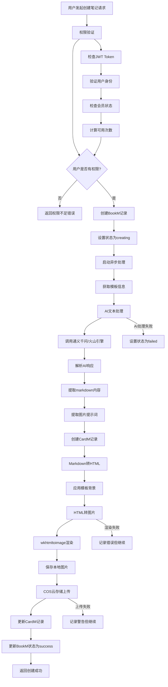

# 创建笔记完整流程文档

## 概述

本文档详细描述了Numind系统中创建笔记（卡册）的完整流程，包括用户权限验证、AI文本处理、模板选择、图片渲染和云存储等各个环节。

## 系统架构

### 核心组件
- **Controller层**: 处理HTTP请求和响应
- **Biz层**: 业务逻辑处理
- **Store层**: 数据访问层
- **Model层**: 数据模型定义
- **Util层**: 工具函数和第三方服务集成

### 主要数据模型
- **User**: 用户信息（包含会员状态）
- **BookM**: 卡册（笔记集合）
- **CardM**: 卡片（单个笔记）
- **Template**: 模板（用于渲染样式）
- **ImageM**: 图片记录

## 完整流程图



## 详细流程说明

### 1. 用户权限验证

#### 1.1 JWT Token验证
- 从请求头`Authorization`中提取Bearer Token
- 使用JWT密钥验证Token有效性
- 解析Token获取用户ID和OpenID

#### 1.2 会员权限检查
系统支持多种会员类型：
- **免费用户**: 有限制次数
- **订阅会员**: 无限制使用
- **资源包会员**: 按次数计费
- **混合会员**: 同时拥有订阅和资源包

权限检查逻辑：
```go
func calculateCreatePermission(user *User) CreatePermission {
    // 检查订阅会员
    if user.CanUseSubscription() {
        return CreatePermission{CanCreate: true, Reason: "订阅会员"}
    }
    
    // 检查资源包
    if user.CanUsePackage() {
        return CreatePermission{CanCreate: true, Reason: "资源包会员"}
    }
    
    // 检查免费用户限制
    if user.BookAllNum < 3 { // 免费用户限制3次
        return CreatePermission{CanCreate: true, Reason: "免费用户"}
    }
    
    return CreatePermission{CanCreate: false, Reason: "超出免费用户限制"}
}
```

### 2. 卡册创建流程

#### 2.1 创建BookM记录
```go
type CreateBookRequest struct {
    Text       string `json:"text" binding:"required"`
    TemplateID string `json:"template_id" binding:"required"`
}

book := &model.BookM{
    UserID:     userID,
    Title:      "AI生成卡册", // 临时标题
    TemplateID: templateID,
    Status:     model.BookStatusCreating,
}
```

#### 2.2 异步处理启动
系统采用异步处理模式，立即返回BookM记录，后台处理具体内容：

```go
// 立即返回
core.WriteResponse(c, nil, book)

// 后台异步处理
go func() {
    p.processBookCreationInBackground(ctx, book.ID, userID, text, templateID)
}()
```

### 3. AI文本处理

#### 3.1 AI服务选择
系统支持多个AI服务提供商：
- **通义千问**: 阿里云AI服务
- **火山引擎**: 字节跳动AI服务

#### 3.2 提示词管理
使用专门的提示词管理器，支持从配置文件读取：

```go
type PromptManager struct{}

func (pm *PromptManager) GetTextProcessingPrompt() string {
    prompt := viper.GetString("ai_prompts.text_processing")
    if prompt == "" {
        // 使用默认提示词
        prompt = `# 角色
你是一位顶级的知识架构师与内容编辑...`
    }
    return prompt
}
```

#### 3.3 AI处理流程
1. **内容性质诊断**: 判断是逻辑驱动型还是情绪驱动型
2. **选择处理路径**: 根据内容类型选择不同的处理策略
3. **文本重构**: 过滤噪音、构建框架、排序串联
4. **输出格式化**: 生成markdown格式的结构化内容

### 4. 模板系统

#### 4.1 模板数据结构
```go
type Template struct {
    gorm.Model
    Name         string `gorm:"size:50;not null;uniqueIndex" json:"name"`
    File         string `gorm:"type:text;not null" json:"file"`        // HTML模板内容
    Preview      string `gorm:"type:text" json:"preview"`               // 预览图片URL
    IsMemberOnly bool   `gorm:"default:false;not null" json:"is_member_only"`
}
```

#### 4.2 模板应用流程
1. 根据TemplateID获取模板信息
2. 提取模板的HTML背景样式
3. 将模板背景应用到内容渲染中
4. 支持会员专用模板的权限检查

### 5. 图片渲染系统

#### 5.1 HTML生成
系统支持两种渲染模式：

**轻量级渲染器**:
- 将markdown转换为HTML
- 应用模板背景样式
- 生成固定尺寸的HTML页面

**流式分页渲染器**:
- 支持内容分页
- 自动计算页面布局
- 生成多页HTML内容

#### 5.2 wkhtmltoimage渲染
使用wkhtmltoimage工具将HTML转换为图片：

```go
func (p *AsyncBookProcessor) renderWithWkhtmltoimage(ctx context.Context, cardID uint, htmlContent, fullImagePath string) (string, error) {
    // 获取渲染槽位，避免资源耗尽
    if err := acquireRenderSlot(ctx); err != nil {
        return "", fmt.Errorf("获取渲染槽位失败: %v", err)
    }
    defer releaseRenderSlot()
    
    // 修复HTML内容中的CSS样式
    fixedHTMLContent := p.fixHTMLContentForRendering(htmlContent)
    
    // 使用wkhtmltoimage渲染
    rendererConfig := p.getRendererConfig()
    renderer := utilpkg.NewWkhtmltoimageRenderer(rendererConfig)
    
    return renderer.RenderHTMLToImage(ctx, fixedHTMLContent, fullImagePath)
}
```

#### 5.3 渲染配置
```go
type WkhtmltoimageConfig struct {
    Width   int           `json:"width"`   // 图片宽度: 1080px
    Height  int           `json:"height"`  // 图片高度: 1440px
    Quality int           `json:"quality"` // 图片质量: 85
    Format  string        `json:"format"`  // 图片格式: webp
    Zoom    float64       `json:"zoom"`    // 缩放比例: 1.0
    Timeout time.Duration `json:"timeout"` // 超时时间: 30s
}
```

### 6. 云存储系统

#### 6.1 COS配置
系统使用腾讯云COS作为图片存储服务：

```go
type COSClient struct {
    client  *cos.Client
    baseURL string
    bucket  string
    enabled bool
}
```

#### 6.2 上传流程
1. **本地图片生成**: 使用wkhtmltoimage生成WebP格式图片
2. **COS上传**: 将图片上传到腾讯云COS
3. **URL生成**: 生成公开访问URL
4. **签名URL**: 可选生成临时签名URL

```go
func UploadBytesToCOS(ctx context.Context, objectKey string, contentType string, data []byte) (string, error) {
    // 构建对象键: card/{card_id}/card_{card_id}.webp
    objectKey := fmt.Sprintf("card/%d/card_%d.webp", cardID, cardID)
    
    // 上传到COS
    _, err := cosClient.client.Object.Put(ctx, objectKey, bytes.NewReader(data), opt)
    if err != nil {
        return "", err
    }
    
    // 返回公开URL
    return fmt.Sprintf("%s/%s", cosClient.baseURL, objectKey), nil
}
```

### 7. 状态管理

#### 7.1 卡册状态
```go
const (
    BookStatusCreating = "creating" // 创建中
    BookStatusAI       = "ai"       // AI处理中
    BookStatusSuccess = "success"  // 成功
    BookStatusFailed  = "failed"    // 失败
)
```

#### 7.2 状态流转
1. **creating**: 初始创建状态
2. **ai**: AI文本处理中
3. **success**: 处理完成
4. **failed**: 处理失败

### 8. 错误处理

#### 8.1 容错机制
- AI处理失败不影响整体流程
- 图片渲染失败记录警告但继续
- COS上传失败不影响本地存储
- 模板加载失败使用默认样式

#### 8.2 重试机制
- AI调用支持重试
- 图片渲染支持重试（最多3次）
- COS上传支持重试

## API接口

### 创建卡册
```
POST /books
Authorization: Bearer <jwt_token>
Content-Type: application/json

{
    "text": "用户输入的文本内容",
    "template_id": "模板ID"
}
```

### 获取模板列表
```
GET /templates
Authorization: Bearer <jwt_token>
```

### 获取模板详情
```
GET /templates/:id
Authorization: Bearer <jwt_token>
```

### 检查创建权限
```
GET /membership/check-create-permission
Authorization: Bearer <jwt_token>
```

## 配置说明

### AI服务配置
```yaml
ai:
  provider: "ali" # 或 "volc"
  ali:
    api_key: "your_api_key"
    model: "qwen-turbo"
  volc:
    api_key: "your_api_key"
    model: "doubao-pro-32k"
```

### COS配置
```yaml
cos:
  enabled: true
  secret_id: "your_secret_id"
  secret_key: "your_secret_key"
  bucket: "your-bucket-name"
  region: "ap-beijing"
```

### 渲染配置
```yaml
resource:
  image_path: "/path/to/images"
  temp_dir: "/tmp"
  
renderer:
  max_retries: 3
  timeout: 30s
  max_concurrent: 2
```

## 性能优化

### 1. 异步处理
- 使用goroutine进行异步处理
- 避免阻塞用户请求
- 提高系统响应速度

### 2. 资源控制
- 渲染槽位限制，避免资源耗尽
- 并发控制，限制同时处理的请求数
- 超时机制，避免长时间占用资源

### 3. 缓存策略
- 模板内容缓存
- AI响应缓存（可选）
- 图片文件缓存

### 4. 错误恢复
- 自动重试机制
- 降级处理策略
- 详细错误日志

## 监控和日志

### 1. 关键指标
- 创建成功率
- 平均处理时间
- AI调用成功率
- 图片渲染成功率
- COS上传成功率

### 2. 日志记录
- 请求开始和结束时间
- 各阶段处理时间
- 错误详情和堆栈信息
- 用户操作记录

### 3. 告警机制
- 处理失败率过高告警
- 响应时间过长告警
- 资源使用率告警
- 服务可用性告警

## 扩展性考虑

### 1. 水平扩展
- 支持多实例部署
- 负载均衡
- 数据库读写分离

### 2. 功能扩展
- 支持更多AI服务商
- 支持更多图片格式
- 支持更多存储后端
- 支持更多模板类型

### 3. 性能扩展
- 分布式任务队列
- 缓存集群
- CDN加速
- 数据库分片

## 总结

Numind系统的笔记创建流程是一个复杂的异步处理系统，涉及用户权限验证、AI文本处理、模板应用、图片渲染和云存储等多个环节。系统采用微服务架构，具有良好的可扩展性和容错性。通过异步处理和资源控制，系统能够高效处理大量并发请求，为用户提供优质的笔记创建体验。
