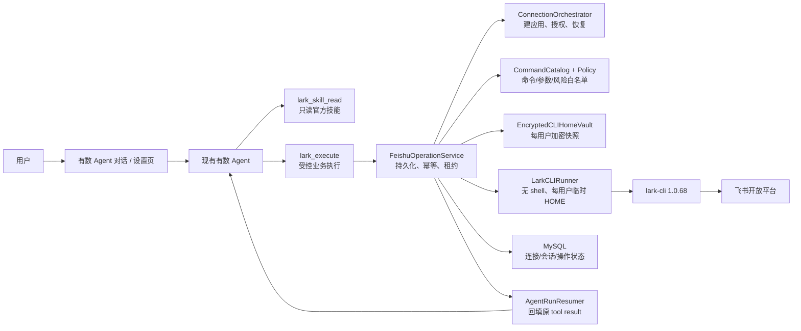
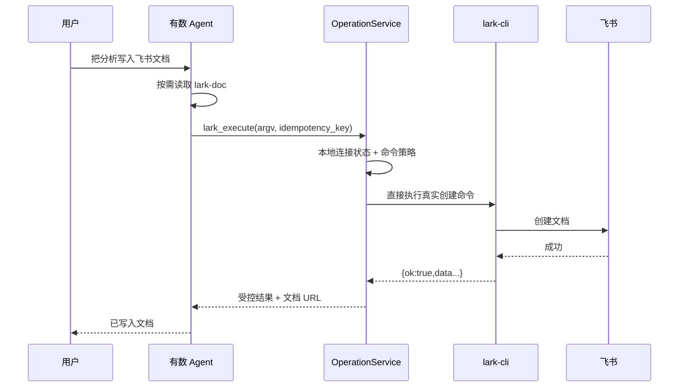
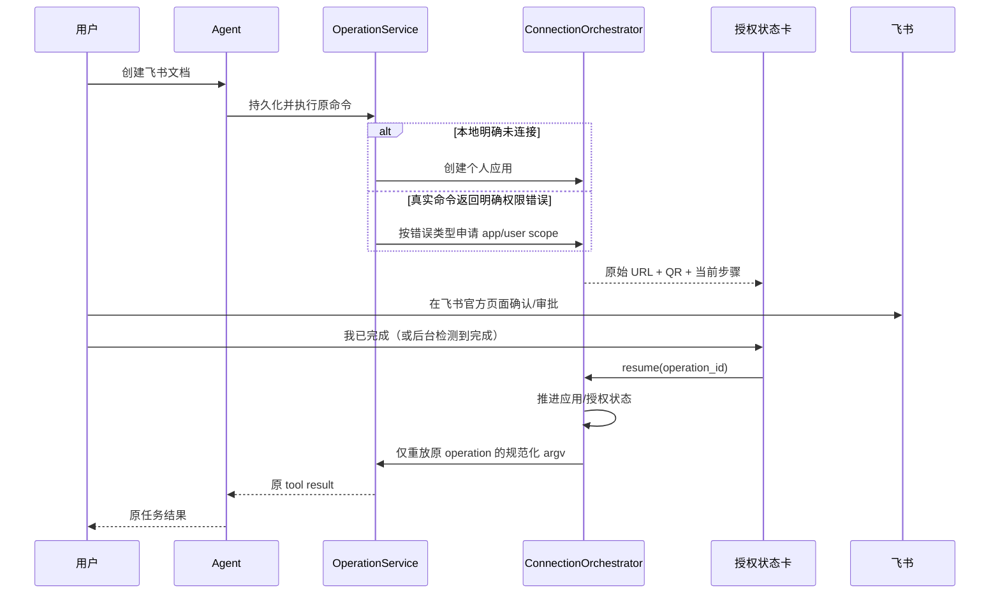
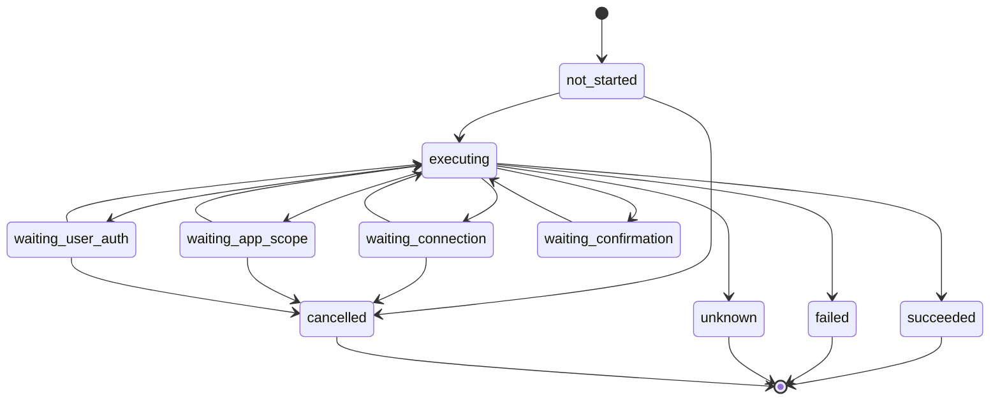

# 飞书个人工作空间连接 — 技术设计

- 日期：2026-07-13
- NDF：Standard / S2
- 涉及仓库：`numind-server`、`numind-web-v3`
- 固定适配器版本：`lark-cli 1.0.68`
- 产品决策：每个有数用户独享一个飞书租户自建应用；现有有数 Agent 负责理解任务和选择飞书操作；确定性编排器负责连接、权限、隔离、恢复和安全边界。

## 1. 设计结论

本功能不把飞书做成一组由后端写死、能力有限的“文档工具”，也不新增第二个飞书 Agent。首版采用三层结构：

1. **现有有数 Agent**：理解用户意图，按需读取当前 lark-cli 版本附带的官方技能说明，决定要执行的 Docs/Base/Wiki 命令及多步顺序。
2. **受控 lark-cli 执行层**：只接受结构化 argv，不接受 shell 字符串；按服务端命令目录、参数规则、风险策略和用户身份执行 lark-cli。
3. **确定性连接编排器**：负责每用户独立应用和凭据、渐进授权、错误分类、跨重启状态、精确重放、并发幂等和解绑。

这与 Claude Code/Codex 的核心语义一致：模型在多租户后端推理，但工具在一个属于当前用户的隔离执行环境中运行。有数的差别只是隔离执行环境由服务端托管，因此必须显式补齐多租户隔离、持久化、租约和审计。

正常热路径不先运行 `auth status`：

- 本地记录明确未连接：直接进入连接流程；
- 本地记录已连接：立即尝试真实飞书业务命令；
- 只有真实命令返回明确的应用权限、用户授权或授权失效错误时，才进入对应恢复；
- 资源 ACL、网络、限流和未知写入结果不伪装成 OAuth 问题。

## 2. 目标与非目标

### 2.1 目标

- 每个有数账号独立连接自己的飞书账号和个人租户自建应用，并长期保持。
- Agent 可创建、读取、更新 Docs、Base、Wiki；不包含 IM。
- 用户第一次提出具体飞书任务时，可以从未连接状态开始；完成飞书官方页面确认后，原操作自动继续。
- 权限按当前操作的精确 scopes 增量申请，不使用 `--domain docs,base,wiki`，更不使用 `all`。
- 授权恢复不让模型重新生成原命令；直接重放加密持久化的规范化操作。
- 连接、授权会话和待执行操作可跨实例、跨后端重启恢复。
- 任意时刻，一个用户只能读取和使用自己的 app、CLI HOME、Token、操作和结果。
- 对写操作结果不确定时停止自动重试，避免重复创建或重复修改。

### 2.2 非目标

- 不提供共享有数应用、应用商店安装或普通员工无管理员配合的兜底路径。
- 不新增独立飞书 Agent。
- 不让 Agent 执行任意 lark-cli 命令、原生 `api` 命令或 shell。
- 不支持 IM、日历、邮箱、审批等其他飞书域。
- 不支持删除、成员/角色/权限管理和无上限批量修改。
- 不在本次把全部飞书调用改为 Go SDK/OpenAPI；适配接口保留未来迁移空间。
- 不合并旧 monitor webhook 飞书链路。

## 3. 系统架构



### 3.1 组件职责

| 组件 | 负责 | 不负责 |
|---|---|---|
| 有数 Agent | 理解任务；按需读取技能；选择允许的飞书命令；组织多步操作；向用户解释结果 | 判断 Token 是否有效；保存凭据；决定能否自动重试；绕过命令策略 |
| `lark_skill_read` | 从固定版本 lark-cli 读取 `lark-shared`、`lark-doc`、`lark-base`、`lark-wiki` 及其受控引用 | 读取任意本地文件；执行飞书业务命令 |
| `lark_execute` | 接收结构化 argv；建立持久化 operation；返回成功、暂停或明确失败 | 直接运行 shell；自行创建连接；接受客户端 user_id |
| `CommandCatalog` | 将命令路径映射到域、动作、scopes、风险、参数约束和副作用语义 | 根据模型自由文本猜权限 |
| `ConnectionOrchestrator` | 创建个人应用；发起 app scope/用户 OAuth；生成新链接；推进授权状态 | 选择用户业务命令；把旧 URL/device code 当作可恢复状态 |
| `FeishuOperationService` | 幂等、租约、错误分类、精确重放、结果存储、Agent 恢复 | 对未知结果写操作盲重试 |
| `EncryptedCLIHomeVault` | 加密保存每用户 lark-cli HOME 快照；乐观锁；运行时解封 | 把明文 Token 写入日志或普通业务表 |
| `LarkCLIRunner` | `exec.CommandContext` 执行固定二进制和 argv；超时、输出上限、JSON 校验 | `/bin/sh -c`；执行不在目录中的命令 |
| 前端状态卡 | 展示当前步骤、原始 URL、二维码、过期和恢复动作 | 自行决定 scopes；拼接或改写飞书 URL |

### 3.2 代码边界

后端建议按以下边界演进：

- `internal/numind/biz/feishu/command_catalog.go`：允许命令、scope、风险、参数规则。
- `internal/numind/biz/feishu/skill_reader.go`：官方技能读取适配器。
- `internal/numind/biz/feishu/operation_service.go`：operation 生命周期和重放。
- `internal/numind/biz/feishu/connect_orchestrator.go`：改为 DB 状态机，不再以持久明文 HOME 为阶段 SOT。
- `internal/numind/biz/feishu/vault.go`：加密 HOME 快照与临时运行目录。
- `internal/numind/biz/feishu/runner.go`：固定二进制、无 shell 执行和 JSON envelope 校验。
- `internal/numind/biz/agent/tool_lark_skill_read.go`、`tool_lark_execute.go`：新的 Agent 工具。
- 旧 `lark_create_doc`、`lark_read_bitable`、`lark_send_message` 从 Agent 工具目录移除；迁移期可在内部保留代码，但不得继续向模型暴露，IM 不得申请权限。

Controller 只做鉴权、绑定和 DTO 转换；所有状态推进放在 biz 层。

## 4. Agent 工具契约

### 4.1 `lark_skill_read`

用途：让 Agent 在需要时读取与运行中 lark-cli 完全同版本的官方操作说明，避免在有数代码中复制一份会过期的技能文档。

输入：

```json
{
  "skill": "lark-doc",
  "reference": ""
}
```

规则：

- `skill` 仅允许 `lark-shared`、`lark-doc`、`lark-base`、`lark-wiki`。
- `reference` 为空时读取主 `SKILL.md`；非空时必须是该技能目录内清单允许的相对引用，拒绝绝对路径、`..`、软链接越界。
- 使用同一固定 lark-cli 的 skills 命令/内嵌资源，不从网络下载，不从用户 HOME 读取。
- 单次输出设置字节上限；超限返回可继续读取的引用目录，不静默截断关键安全说明。
- 这是只读工具，不要求用户已连接飞书。

返回：

```json
{
  "ok": true,
  "skill": "lark-doc",
  "cli_version": "1.0.68",
  "content": "...",
  "references": [],
  "receipt": "<signed opaque receipt>"
}
```

主技能若超过单次输出上限，使用显式 cursor 分页，不能静默截断；只有当前 Agent run 已读取该技能的全部必需分页后才签发 receipt。receipt 用服务端 HMAC 绑定 `agent_run_id + skill + cli_version + expires_at`，不包含用户凭据，跨实例可校验。同一 run 内可复用；换 CLI 版本、换 run 或过期后必须重读。

### 4.2 `lark_execute`

输入：

```json
{
  "argv": ["docs", "+create", "--title", "销售分析"],
  "stdin_json": null,
  "idempotency_key": "agent-run-123:tool-call-456",
  "skill_receipts": ["<lark-shared receipt>", "<lark-doc receipt>"]
}
```

`argv` 不含二进制路径。服务端完成以下规范化后才持久化和执行：

1. 校验当前 run 已完整读取 `lark-shared` 和命令所属域技能的签名 receipt；缺失时返回可恢复的 `skill_required`，不执行命令。
2. 解析命令路径，必须精确命中 `CommandCatalog`。
3. 删除/拒绝 Agent 不能控制的身份、HOME、profile、brand、config、auth flags。
4. 强制用户身份 `--as user`，禁止 bot fallback。
5. 校验 flags、位置参数、URL/token 格式、数组长度、内容和输出上限。
6. 根据命令和参数计算风险与 exact scopes，忽略模型声明的风险/scopes。
7. 以 `user_id + idempotency_key` 建 operation；同键返回原 operation，不重复创建副作用。
8. 敏感 argv/stdin 先加密再写 DB，日志中只记录命令路径和长度。

返回统一 envelope：

```json
{
  "ok": false,
  "state": "waiting_user_auth",
  "operation_id": "op_uuid",
  "action": {
    "phase": "user_auth",
    "session_id": "auth_uuid",
    "url": "<opaque feishu url>",
    "expires_at": "2026-07-13T12:30:00+08:00"
  }
}
```

成功时返回 lark-cli `data` 的受控子集和必要资源 URL；不把 Token、app_secret、device_code、完整 HOME 或原始响应头返回给模型。

### 4.3 为什么不是“任意 CLI”

Agent 仍有自主判断：它读取官方技能、选择具体命令、解析上一步结果并组织下一步。对应域技能在每个 Agent run 第一次执行前必须读取，签名 receipt 使这条官方要求可以被执行层验证，而不是只写在提示词里。但工具执行边界与 Claude Code 的本地 shell 不同：有数托管多个用户的长期凭据，所以命令目录、参数和身份必须由服务端约束。这个约束不替代模型判断，只防止越权和跨域执行。

## 5. 首版命令目录与权限

所有授权都用 `auth login --scope <exact scopes>`，不使用 `--domain`。lark-cli 自动补充长期授权所需的 `offline_access`。设置页单独发起“连接”时只请求 `offline_access`；具体业务 scope 在首次真实操作需要时增量申请。

### 5.1 Docs

| 业务能力 | lark-cli 能力 | 用户 scopes | 风险策略 |
|---|---|---|---|
| 创建文档 | `docs +create` | `docx:document:create` | 允许；按 idempotency key 防重复 |
| 读取文档 | `docs +fetch` | `docx:document:readonly` | 允许 |
| 更新文档 | `docs +update` | `docx:document:write_only`、`docx:document:readonly` | append、精确替换、插入允许；删除 block 禁止；已有文档全量 overwrite 进入高风险确认 |

为刚由同一 operation chain 创建的空文档写入初始内容，可使用 overwrite，不视为覆盖既有用户内容；需要用上一步返回的文档 token 证明资源由当前 chain 新建。

### 5.2 Base

| 业务能力 | lark-cli 能力 | 用户 scopes | 风险策略 |
|---|---|---|---|
| 创建 Base | `base +base-create` | `base:app:create`、`base:table:read/create/update/delete` | 允许创建；服务端仍拒绝任何 delete 命令 |
| 读取 Base/表/字段/视图 | `+base-get`、`+table-list/get`、field list/get | `base:app:read`、`base:table:read`、`base:field:read`、`base:view:read` | 允许 |
| 读取记录 | record get/list/search | `base:record:read` | 允许；分页和总量设上限 |
| 创建/更新表 | `+table-create/update` | `base:table:create/update`、相关 field/view scopes | 允许；删除表禁止 |
| 创建/更新字段 | field create/update | `base:field:create/update` | 创建/重命名允许；改变已有字段类型进入高风险确认 |
| 创建/更新记录 | record create/upsert/update | `base:record:create/update` | 允许单条或受限批次；超阈值进入高风险确认 |

已知限制：lark-cli 1.0.68 的 `+base-create` 为替换默认初始表而声明了 `base:table:delete`。这是官方 shortcut 的 scope 粒度，不代表有数开放删除能力。产品授权说明必须如实提示该 scope；服务端命令与参数策略仍禁止所有 delete 路径。若真实租户验证发现该 scope 无法接受，后续只替换 Base create adapter，不改变上层 Agent/operation 契约。

默认批量阈值：一次最多更新 20 条记录；更大批次要求 Agent 拆分且进入通用高风险确认。任何 delete、truncate、清空字段值的无条件全表操作均拒绝。

### 5.3 Wiki

| 业务能力 | lark-cli 能力 | 用户 scopes | 风险策略 |
|---|---|---|---|
| 创建空间 | `wiki +space-create` | `wiki:space:write_only` | 允许；用户身份 |
| 创建节点 | `wiki +node-create` | `wiki:node:create`、`wiki:node:read`、`wiki:space:read` | 允许 |
| 读取节点/列表 | `wiki +node-get/list` | `wiki:node:retrieve` | 允许 |
| 读取/更新节点内容 | 先解析 Wiki node 得到 doc token，再用 Docs fetch/update | 上述 Wiki scopes + Docs read/write scopes | 与 Docs 规则相同 |

首版不承诺自然语言全局搜索整个知识库。Agent 可处理用户给出的 Wiki URL、space/node token，或在明确空间中列举和定位节点。知识库标题更新若 lark-cli 1.0.68 没有稳定 shortcut，则首版仅更新节点承载的文档内容，不用 raw API 绕过目录。

### 5.4 永久拒绝项

- `api ...` 原生透传；
- `auth ...`、`config ...`（仅 ConnectionOrchestrator 内部可用）；
- IM 及其他域；
- delete/remove/trash/purge；
- 成员、角色、权限、分享范围修改；
- app 凭据导出、Token 查询、HOME 路径控制；
- bot 身份和跨 app/profile 选择；
- 未在 `CommandCatalog` 注册的新版本命令。

CLI 自带 `policy.yml` 作为第二道防线：只允许上述命令路径、只允许 user identity，并在所有规则中显式 deny 删除、IM、raw API、权限管理。服务端策略是主防线，因为 CLI policy 只能按路径控制，无法判断 `docs +update --command block_delete` 这类参数级风险。

## 6. 业务执行与授权流程

### 6.1 已连接用户



这里没有前置 `auth status` 或 scopes 全量探测。连接状态缓存只用于已知未连接时避免无效调用，以及设置页展示。

### 6.2 从未连接，或缺少权限



连接阶段：

1. `create_app`：`lark-cli config init --new` 创建该用户独享应用。
2. `waiting_app_approval`：真实命令识别为应用级 scope 缺失，展示 lark-cli 返回的官方 console URL，等待管理员批准。
3. `waiting_user_auth`：持有 auth-session DB 租约的后台 worker 运行阻塞式 `auth login --json --scope <exact scopes>`，从进程输出提取原始 verification URL 后立即让 Agent/UI 展示；lark-cli 子进程继续等待用户确认，成功退出时自动触发 operation resume。
4. `resume_operation`：用 fresh device flow 完成用户授权后，精确重放原 operation。

不是每次连接都经历全部四步。已有应用只增量授权；应用 scope 已批准但用户 token 缺 scope 时直接进入用户授权。

### 6.3 链接和重启语义

- 不持久化 verification URL、device_code 或建应用页面临时 URL；短期授权状态由持有 DB 租约的 lark-cli 子进程管理。
- DB 只持久化 phase、requested scopes、operation 关联和过期时间。
- 用户点击“重新生成链接”，或服务重启导致租约/子进程丢失后，编排器废弃旧 session，启动新的后台 auth worker 并返回新 URL。
- 若用户已在旧页面完成且 HOME 快照中已出现有效 app/token，先对本地状态做一次恢复检查，再决定是否生成新链接。
- `auth status` 只允许用于连接恢复、设置页主动刷新和诊断；不得进入每个业务命令的热路径。

## 7. 状态模型

### 7.1 Connection state

`none | creating_app | app_ready | waiting_app_approval | waiting_user_auth | connected | reauth_required | error | disconnecting`

- `connected` 表示存在个人 app 且最近一次用户授权/业务操作可用，不表示所有 Docs/Base/Wiki 权限已授予。
- 每项 capability 另有最近已知状态：`unknown | available | needs_app_scope | needs_user_scope | revoked | resource_denied`。
- 真正业务操作结果的优先级高于 capability 缓存。

### 7.2 Operation state



只有错误分类明确保证原请求未产生副作用时，`executing` 才能进入授权等待并在之后自动重放。超时、连接断开、飞书 5xx、CLI 被杀、输出损坏等发生在写命令时，一律进入 `unknown`，禁止自动重试。

### 7.3 多步任务

Agent 仍按正常 ReAct 顺序发起多个 `lark_execute`。每个 CLI 调用是独立 operation，使用各自 idempotency key。例如 Wiki 创建并写入内容：

1. `wiki +node-create` 成功，结果中的 node/doc token 回给 Agent；
2. Agent 再发 Docs update；
3. 若第二步缺权限，只暂停和重放第二步，不重复创建 Wiki 节点。

## 8. 数据模型

### 8.1 `user_third_party_account` 扩展

保留 `(user_id, provider)` 唯一键，`provider='lark'`。新增：

| 字段 | 说明 |
|---|---|
| `connection_state` varchar(32) | 顶层状态 |
| `lark_cli_version` varchar(32) | 最近写入 vault/执行成功的版本 |
| `granted_scopes_json` json/text | 最近已知 scopes，仅作缓存 |
| `capability_state_json` json/text | Docs/Base/Wiki 最近已知状态 |
| `last_success_at` datetime nullable | 最近业务成功时间 |
| `last_error_code` varchar(128) nullable | 脱敏错误码 |
| `generation` bigint | 解绑/重连代际，防旧任务复活 |

兼容期保留 `connected`，由 `connection_state='connected'` 派生写入；新代码不得只看布尔值决定阶段。

### 8.2 `feishu_cli_vault`

| 字段 | 说明 |
|---|---|
| `user_id` PK | 与有数用户一一对应 |
| `generation` bigint | 与账号 generation 一致 |
| `ciphertext` longblob | lark-cli HOME 压缩快照的 AES-256-GCM 密文 |
| `key_version` varchar(32) | 主密钥版本 |
| `checksum` binary/varchar | 密文完整性辅助校验 |
| `revision` bigint | CAS 乐观锁版本 |
| `created_at/updated_at` | 审计时间 |

AAD 至少包含 `user_id`、`provider`、`generation`、`key_version`。主密钥来自现有受控环境变量/密钥配置，不进 Git 和数据库。运行时：

1. 获取该用户 DB 租约；
2. 解密到新建的临时 HOME（目录 `0700`，文件 `0600`）；
3. 执行一个 CLI 命令；
4. 若 HOME 改变，以 revision CAS 重新加密写回；
5. 删除临时目录；异常退出由启动清理器清除过期目录。

不再把服务器磁盘上的长期明文 HOME 作为产品 SOT。迁移时将现有 HOME 一次性导入 vault，确认成功后安全删除原目录。

### 8.3 `feishu_auth_session`

| 字段 | 说明 |
|---|---|
| `id` uuid | 会话 ID |
| `user_id`、`generation` | 所有权与代际 |
| `operation_id` nullable | 触发该授权的 operation |
| `phase` | `create_app/app_scope/user_auth` |
| `requested_scopes_json` | 服务端计算的 scopes |
| `state` | `pending/completed/expired/rejected/failed/superseded` |
| `lease_owner/lease_until` | 持有阻塞式 lark-cli 子进程的实例租约 |
| `expires_at` | UI 判断是否需刷新 |
| `created_at/updated_at/completed_at` | 时间 |

不存 URL/device_code。device flow 所需短期状态只存在受保护的 lark-cli 子进程及其 worker 内存中；进程或租约丢失后 session 标为 superseded 并生成新的链接。后台 worker 正常完成时更新 DB 会话状态并投递 operation resume，因此用户不必点击“我已完成”；按钮只是主动检查/加速 UI 刷新。

### 8.4 `feishu_operation`

| 字段 | 说明 |
|---|---|
| `id` uuid | operation ID |
| `user_id`、`generation` | 所有权与解绑代际 |
| `agent_run_id`、`tool_call_id` | 原 Agent 工具调用 |
| `idempotency_key` | 与 user_id 联合唯一 |
| `command_path`、`domain`、`risk_level` | 可审计元数据 |
| `request_ciphertext`、`key_version` | 规范化 argv/stdin 密文 |
| `request_fingerprint` | 去重哈希，不可反推内容 |
| `state`、`attempt_count` | 生命周期 |
| `lease_owner`、`lease_until` | 多实例执行租约 |
| `error_type/subtype/code` | 结构化错误，不存敏感 detail |
| `result_ciphertext` nullable | 受控结果密文 |
| `result_summary_json` nullable | UI 可用的无敏感摘要 |
| `created_at/started_at/updated_at/finished_at` | 时间 |

租约过期后：读命令可以重新 claim；写命令若上次已进入实际 CLI 调用但未得到明确结果，转 `unknown`，不重新执行。

## 9. 错误分类与自动恢复

优先解析 lark-cli JSON：成功不仅要求进程 exit 0，还要求 envelope `ok=true`。错误使用 `type/subtype/code/permission_violations/identity/console_url` 分类。

| 分类 | 示例 | 自动动作 | 是否重放原写操作 |
|---|---|---|---|
| 未连接 | 无 app/vault/用户身份 | 创建 app 或用户授权 | 完成后可重放 |
| app scope 缺失 | app-level violation、官方 console URL | 展示管理员审批步骤 | 仅明确未执行时可重放 |
| user scope 缺失/授权失效 | user missing_scope/unauthorized | exact scopes 重新 auth login | 仅明确未执行时可重放 |
| resource ACL | 文档/表/空间无访问权 | 提示用户开放具体资源 | 否；不重新 OAuth |
| 参数/资源错误 | URL/token 无效、资源不存在 | 返回 Agent 修正 | 否 |
| 限流 | 429/结构化 rate limit | 有界退避；写操作仅在明确未提交时 | 视错误语义 |
| 瞬时读失败 | 网络/5xx/timeout | 有界重试读命令 | 可 |
| 未知写结果 | timeout、进程退出、5xx 响应丢失 | 标记 `unknown`，请用户核对 | 禁止 |
| 策略拒绝 | 命令/参数/风险不在首版 | 明确告知不支持 | 否 |

错误分类器默认 fail closed。只有列入固定版本 contract test 的错误 code/subtype 才能声明“无副作用，授权后可重放”；未知 code 不根据错误文案模糊匹配。

## 10. HTTP API

所有接口从登录 Token 解析 user_id，客户端不得传 user_id、scopes、argv 或 app_id。

### 10.1 `GET /v1/feishu/status`

只读，不生成新授权链接：

```json
{
  "code": 0,
  "data": {
    "state": "connected",
    "connected": true,
    "app_id_masked": "cli_****8f2a",
    "cli_version": "1.0.68",
    "capabilities": {
      "docs": {"state": "available", "last_success_at": "..."},
      "base": {"state": "unknown"},
      "wiki": {"state": "needs_user_scope"}
    },
    "active_action": {
      "operation_id": "op_uuid",
      "session_id": "auth_uuid",
      "phase": "user_auth",
      "expires_at": "...",
      "link_available": false
    }
  }
}
```

### 10.2 `POST /v1/feishu/connect`

Body：

```json
{"intent": "manual"}
```

手动连接只推进个人 app + `offline_access` 用户身份，不预先申请 Docs/Base/Wiki。若由 operation 触发，operation_id 只通过服务端 Agent/状态卡上下文关联，不允许客户端指定其他人的 operation。

返回统一 `state + action`；action 可为 `open_url | wait_admin | none`。

### 10.3 `POST /v1/feishu/operations/:id/resume`

Body：

```json
{"action": "user_completed"}
```

服务端验证 operation 归属、当前等待状态、generation 和租约，读取 auth worker 的最新状态；若已完成则精确执行已存 operation，仍在等待则返回当前状态。客户端不能提交新 scopes/argv。重复调用幂等，成功 operation 直接返回相同结果摘要。即使用户不调用此接口，auth worker 成功退出也会自动触发同一恢复逻辑。

### 10.4 `POST /v1/feishu/actions/:session_id/refresh`

旧 session 和其 worker 标记 superseded/终止，生成新的原始 URL。响应永远不返回 device_code。前端用 URL 本地生成二维码，二维码内容与 URL 字节完全一致。

### 10.5 `DELETE /v1/feishu/connection`

解绑事务语义：

1. connection 进入 `disconnecting` 并 generation +1；
2. 取消未执行/等待中的 operations 和 auth sessions；执行中操作等待租约或按未知结果收口；
3. 尽力运行 lark-cli logout/remove，再删除 vault 密文和临时 HOME；
4. 清除 DB 连接状态和能力缓存；
5. 返回“有数侧连接已删除；飞书侧个人自建应用仍保留，可在飞书开放平台自行删除”。

远端 app 无法可靠自动删除，因此不得向用户声称飞书侧应用已删除。

## 11. Agent 精确恢复

现有 `feishu_connect` 使用 ask-user-answer 后重新启动一轮 Agent，可能让模型重新生成工具参数。新设计改为外部操作暂停：

- `lark_execute` 在 operation 等待授权时发出结构化 `auth_action` SSE/消息卡，并把原 tool call 标记为等待外部结果。
- 用户点击“我已完成”只调用 operation resume，不作为一条自然语言答案喂给模型。
- Operation 成功后，`AgentRunResumer` 把已存结果作为原 `tool_call_id` 的 tool result 回填 Agent transcript，再恢复正常 Agent 生成最终说明。
- 模型可以在拿到真实 tool result 后决定下一步，但不能在授权间隙重新生成刚才那条 argv。
- 如果原 run 已取消/删除，operation 仍按安全规则收口，但不自动新建 Agent run；结果可在会话中显示为系统状态卡。

需要为 `agent_run` 增加外部工具等待状态或等价的持久化关联，不能借用普通问答文本模拟。

## 12. 前端交互设计

### 12.1 Agent 对话状态卡

主入口是原任务所在对话。状态卡只展示当前需要用户做的一步，并附可折叠的完整进度：

1. 创建个人应用；
2. 等待管理员批准应用权限（仅需要时）；
3. 用户授权；
4. 继续原任务。

行为：

- URL 以可复制文本完整展示，视为 opaque string，不编码、截断后复制或添加字符。
- URL 下方用现有 `qrcode` 库渲染二维码；两者内容完全相同。
- 明确显示链接有效期；过期显示“重新生成链接”，不继续提交旧链接。
- 保留“我已完成，继续”，调用 operation resume；也可在有限时间内后台低频刷新状态。
- 正常业务操作不展示“正在检查权限”。
- `aria-live="polite"` 播报步骤变化，错误用 `role="alert"`；状态不只依赖颜色，按钮有可访问名称。
- 手机端 URL 可换行，二维码不溢出，主操作按钮可触达。

文案示例：

- 创建应用：“为你的有数账号创建一个独立飞书自建应用。请在飞书官方页面确认。”
- 管理员审批：“应用已经创建，但这项能力需要飞书管理员批准。批准后回到这里继续。”
- 用户授权：“请授权本次任务需要的文档权限。以后使用已授权能力时不会重复出现。”
- 资源 ACL：“飞书账号已连接，但当前文档未向该账号开放。请在飞书中调整这个文档的访问权限。”

### 12.2 设置页

设置页是辅助入口，展示：

- 真实连接状态；
- 脱敏 app/account 信息；
- Docs/Base/Wiki 最近已知能力状态；
- “连接/继续连接”“重新授权”“解绑”；
- 说明：具体能力在 Agent 首次使用时按需授权；不包含消息发送。

未连接空状态提示用户可直接在 Agent 中提出飞书任务。解绑必须使用现有确认弹窗，明确远端 app 保留。

### 12.3 前端文件范围

- 更新 `src/api/feishu.ts`、`src/stores/feishu.ts` 的状态和 API 契约。
- 将 `AgentAuthPrompt.vue` 演进为可恢复的飞书 action card，或新增专用 `FeishuActionCard.vue` 并由 `AgentMessageItem.vue` 渲染。
- 更新 `FeishuConnection.vue`，删除 IM 和“逐步问 Agent 连接”的旧文案。
- 保持 `.impeccable.md` / `DESIGN.md` 的可靠、克制、绿色品牌语言；不增加无关装饰。

## 13. 安全设计

### 13.1 多租户隔离

- user_id 只来自鉴权 context；所有 store 查询必须同时带 user_id/generation。
- 临时 HOME 路径由服务端生成随机目录，不使用客户端片段。
- 同一用户 CLI 操作用 DB 租约串行化；不同用户可并行。
- vault AAD 绑定 user_id/generation，复制其他用户密文无法解密为当前用户 HOME。
- API 归属错误统一返回不存在，避免枚举 operation/session。
- 解绑 generation +1，使旧回调、旧 session、旧 operation 永久失效。

### 13.2 执行安全

- 固定绝对二进制路径和 SHA256；启动时校验 `lark-cli version == 1.0.68`，不匹配则 feature fail closed。
- 永远使用 `exec.CommandContext(binary, argv...)`，不使用 shell。
- 设置 `LARKSUITE_CLI_NO_UPDATE_NOTIFIER=1` 等稳定机器输出变量。
- stdout/stderr 分别限长；只解析 JSON envelope；超限或非 JSON 视为 adapter error。
- command catalog + CLI policy 双层允许列表；未注解命令 fail closed。
- 内容、URL、argv、Token、app_secret、device_code 不进普通日志、Langfuse input/output 或错误追踪。

### 13.3 凭据安全

- HOME 只以 AES-256-GCM 加密快照长期保存；运行时临时目录 `0700/0600`。
- 主密钥不进入数据库、Git、前端或 lark-cli HOME；支持 key_version 轮换。
- request/result 中可能含文档正文或 Base 数据，同样加密存储并设置生命周期清理。
- 默认 operation 密文保留 7 天；成功结果被 Agent 消费后可提前清理正文，仅留审计摘要。失败/unknown 保留到用户处理完成后再清理。

## 14. 可观测性

不新增独立 LLM generation。沿用原 Agent trace，新增 spans：

- `tool.lark_skill_read`
- `tool.lark_execute`
- `feishu.operation.execute`
- `feishu.connect`
- `feishu.auth`
- `feishu.operation.resume`
- `feishu.vault.open/seal`

可记录：内部 user_id 或不可逆标识、agent_run_id、tool_call_id、operation_id、command_path、domain、risk、state transition、CLI version、duration、exit code、error type/subtype/code、requested scope 数量、attempt_count。

禁止记录：argv 值、stdin、文档/Base 内容、Token、app_secret、device_code、完整 URL、完整 app_id。

指标：

- 连接成功率和各阶段耗时；
- app approval / user auth / resource ACL / unknown write 分类数量；
- Docs/Base/Wiki 操作成功率；
- policy deny、跨用户拒绝、vault CAS 冲突；
- unknown 写操作数量（必须单独告警）；
- 授权循环检测次数。

同一 operation 连续两次进入相同授权状态且 requested scopes 不变时停止循环，转人工可读错误。

## 15. 版本、部署与迁移

### 15.1 固定版本

- 构建机安装并校验 lark-cli 1.0.68，不依赖开发者机器全局版本。
- 二进制和官方技能来自同一发行物。
- 升级必须先运行 command catalog contract tests、官方 `cmd/auth` 和 `internal/cmdpolicy` tests，并比较命令/scopes/risk manifest；不能浮动升级。
- 版本不匹配时连接入口显示“飞书执行组件暂不可用”，不降级到不受控命令。

### 15.2 数据迁移

1. 增加新列和三张新表，旧功能仍可读原字段。
2. 对现有每用户 HOME 做离线/单用户锁迁移：校验权限 → 打包加密 → 写 vault → 解密自检 → 标记版本 → 删除明文 HOME。
3. 新工具 feature flag 灰度开启；旧工具不再向 Agent 注册。
4. 新状态稳定后再删除旧 app_secret/token 列的依赖；列本身可后续单独 migration 清理。

迁移失败时保持旧数据不删除并让该用户 feature fail closed；不得部分迁移后同时让新旧 runner 使用同一凭据。

### 15.3 回滚

- 回滚应用代码时关闭新 feature flag，停止新的 operations；不自动解密导出 vault 到旧明文 HOME。
- 已执行中的写 operation 按 unknown 规则收口。
- 新表和新列保留，不做破坏性 down migration。
- 用户可继续解绑以删除有数侧 vault；回滚不能恢复已撤销的飞书权限。

## 16. 测试策略

### 16.1 单元/契约测试

- CommandCatalog：所有允许命令、exact scopes、risk、参数上限；删除/IM/raw API/auth/config 全部拒绝。
- argv parser：无 shell 注入、无路径穿越、不能改 HOME/identity/profile；中文/空格内容保持原样。
- lark-cli JSON：`ok=false` 即使 exit 0 也失败；非 JSON、超限、版本变化 fail closed。
- 错误分类：app scope、user scope、reauth、resource ACL、rate limit、5xx、timeout、unknown write。
- idempotency：同 user+key 单副作用；不同用户相同 key 不冲突。
- lease：多实例只有一个执行者；写执行中租约丢失转 unknown。
- vault：跨用户/AAD 解密失败、revision CAS、key rotation、临时目录权限和清理。
- generation：解绑后旧 session/operation 无法恢复。
- skill reader：只允许四个技能，引用不能越界，版本一致；未完整读取不给 receipt；跨 run/过期/伪造 receipt 拒绝。

### 16.2 后端集成测试

- never-connected → create app → app approval → user auth → exact replay。
- connected hot path 断言不调用 `AuthStatus`。
- permission error 后只申请 operation scopes，不加入 IM/其他域。
- 资源 ACL 不触发 auth login。
- 同一 operation 重复 resume 不重复写。
- 三个阶段分别模拟后端重启，状态不丢；旧 URL 不复用。
- Agent 恢复回填同一 tool_call_id，不产生新的 argv。
- 解绑删除 vault/会话/等待操作，执行中操作安全收口。

### 16.3 前端测试

- 状态卡四阶段、链接过期、刷新、拒绝、管理员等待、资源 ACL、成功。
- URL 文本和二维码 payload 完全一致。
- resume 调 operation API，不提交 scopes/argv，不伪装自然语言回答。
- ARIA live/error、键盘操作、移动端布局。
- 设置页无 IM 文案，能力状态不把 `unknown` 显示成已授权。

前端 UI 变更必须先用 Playwright 诊断现状，再实现并运行 `npm run lint && npm run type-check`。

### 16.4 真实租户 E2E（发布硬 Gate）

使用有应用创建权、可完成管理员审批的测试账号验证：

1. 首次连接和只申请 `offline_access`；
2. Docs 创建/读取/更新；
3. Base 创建、表/字段/记录读取与更新；确认 `+base-create` 的 delete scope 提示；
4. Wiki 创建节点、解析并读取/更新内容；
5. app scope 与 user scope 两类缺失错误 JSON；
6. create_app / app approval / user auth 三阶段分别重启后端；
7. 两用户并发隔离；
8. 撤销用户授权后自动进入 reauth；
9. 制造写超时，确认进入 unknown 且不重复创建；
10. 解绑后不能继续访问，服务器无明文 HOME 残留。

若真实错误结构无法稳定区分 app scope 与 user scope，或无法证明写错误无副作用，则相应自动重放必须关闭，不得靠错误字符串猜测。

### 16.5 S2 真实账号 spike 状态

PASS（2026-07-13）。已完成源码级验证和真实飞书租户验证：个人应用由 CLI 自动创建；初始仅授权 `offline_access`；Docs/Base/Wiki 在缺少业务 scope 时均稳定返回 exit 3 + `authorization/missing_scope` + exact `missing_scopes`；Docs create/read/update 在增量授权后原命令重放成功，最终复读确认 revision 和正文已更新。

本测试租户没有出现独立管理员审批步骤；产品仍保留 `waiting_app_approval`，处理企业策略或错误返回 `console_url` 的情况。完整证据见 `.ndf/features/feishu-personal-workspace/s2-real-tenant-spike.md`。

## 17. 实施顺序约束

S3 实施计划必须按以下依赖排序：

1. migrations、store、vault、版本校验；
2. command catalog、runner、错误分类 contract tests；
3. operation service 和连接编排器；
4. `lark_skill_read`、`lark_execute` 和 Agent 外部工具恢复；
5. HTTP API；
6. 前端状态卡和设置页；
7. 自动测试、真实租户 E2E、灰度和旧工具下线。

任何任务不得先把通用 shell/任意 CLI 暴露给 Agent 再补安全限制；安全目录、加密和幂等必须先于业务能力开放。

## 18. S2 Gate 结论

技术路线已锁定：**Agent 按需读取官方技能并选择命令，受控 lark-cli 执行，确定性编排连接与恢复**。不再采用“三个固定飞书工具 + 每次 auth status”的旧架构。

S2 Gate 已满足：用户批准本设计，真实飞书测试租户最小 spike 通过。可以进入 S3 实施计划；完整 Docs/Base/Wiki 真实 E2E 仍是发布硬 Gate。
