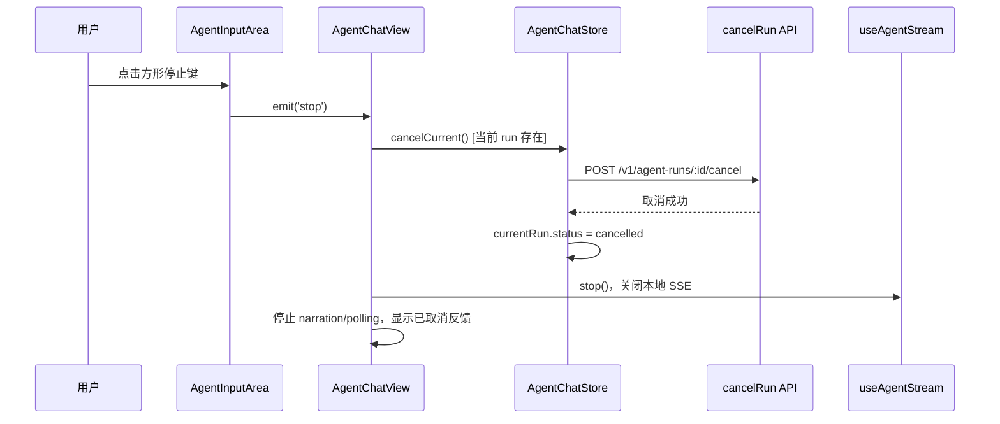

# Agent 运行界面精简与真实停止设计

**Feature:** `agent-runtime-ui-simplify`  
**Date:** 2026-07-19  
**Repository:** `numind-web-v3`  
**Status:** S2 design approved by the user's explicit authorization to execute this Standard feature through Dev.

## 1. 问题与目标

当前 Agent 对话页有三处重复或干扰信息：输入中的积分预估、欢迎区的“🤖 + Agent 名称”标签、顶部的“取消任务”按钮。此外，输入区方形停止键只中止本地 SSE，不能保证服务端 Agent run 停止；用户看到停止后，后台任务仍可能继续。

本设计在不修改计费、权限或后端 API 的前提下，令输入框成为唯一、真实的停止入口，并缩小“新内容”回到底部控件。

### 非目标

- 不改动 `Reserve/Reconcile`、预估 API 或真实积分扣减逻辑。
- 不新增、删除或修改后端端点。
- 不改动 Agent 执行、工具调用、会话持久化或流协议。
- 不移除顶部的 Agent 名称与移动端侧边栏开关；待删除的是欢迎区内的 emoji + 名称 pill。

## 2. 方案比较与决策

| 方案 | 描述 | 结论 |
| --- | --- | --- |
| A | 仅删除顶部取消按钮，保留输入 stop 的 `AbortController.abort()` | 拒绝：断开页面流不等于取消后端 run，形成假停止。 |
| B | 保留顶部取消按钮，同时在输入区继续仅中断 SSE | 拒绝：行为仍不一致，且界面保留重复停止入口。 |
| C（采用） | 输入 stop 统一执行后端取消和本地流清理，删除顶部取消按钮 | 采用：一个入口、一套真实状态、复用既有 API/store。 |

## 3. 组件与数据流

### 3.1 `AgentInputArea.vue`

- 删除 `estimate` prop、`estimate-request` emit、500ms debounce 及预估展示/CSS。
- 输入变化不再调用 `estimateRun`；附件上传、字数提示、发送和停止行为不变。
- 运行中继续显示 `Square` 图标停止键，保留 `aria-label` 与 `title`。

### 3.2 `AgentChatView.vue`

- 删除 `handleEstimateRequest` 及两个 `estimate`/`estimate-request` 绑定。
- 新增唯一 `handleStop()`，取代两处直接 `@stop="stopStream"`：
  1. 若已从 `stream_start` 取得 `store.currentRun`，先调用既有 `runCtrl.cancel()`。
  2. 取消成功后，调用 `stopStream()`、停止 narration 与 polling，并展示既有“已取消任务”提示。
  3. 取消接口失败时，显示错误提示且不伪造 `cancelled` 状态；保留本地 stream 和停止键，以便用户重试真实取消而非落入无入口的运行态。
  4. 在 `stream_start` 到达前没有可靠 `run_id`，仅可中止尚未绑定的浏览器请求；停止键在该极短窗口禁用，并以 `title` 告知正在建立任务。收到 `stream_start` 后才允许真实取消。这避免提供明知无法兑现的停止操作。
- 移除 `AgentChatHeader` 的 run/cancelling/cancel props 和 `@cancel` 绑定。

### 3.3 `AgentChatHeader.vue`

- 删除取消按钮、`Pause`/`AppButton` import、取消相关 props/computed/emits/CSS。
- 保留 Agent 名称、侧边栏切换和响应式布局。

### 3.4 `AgentFirstRun.vue`

- 删除 `.first-run__identity` 及其 emoji/name 子节点和 CSS。
- 保留欢迎语 heading，因它本身是新会话的任务导向提示。

### 3.5 `AgentMessageList.vue`

- 保留现有仅在用户打断自动滚动时显示的逻辑与 `aria-label="回到底部"`。
- 删除 `新内容` 文本；按钮固定为圆形，以 `ChevronDown` 图标表达动作。
- 保留 hover/focus 可见反馈；不改变滚动状态机。

## 4. 状态与错误处理

| 场景 | 处理 |
| --- | --- |
| 未运行/已结束 | 无停止键，不发取消请求。 |
| 正在建立 SSE、尚未收到 `stream_start` | 停止键禁用，避免无 run_id 的假取消；用户可等待极短绑定窗口。 |
| `stream_start` 后正在运行 | 停止键可用；取消 API 成功后 run 转 `cancelled`、流停止、输入恢复。 |
| 取消 API 失败 | 维持服务端真实 run 状态，显示错误通知；不会显示“已取消”。 |
| 只读历史 | 不显示输入区与停止入口。 |
| 取消完成 | 发送按钮恢复；既有 `cancelCurrent()` 系统消息作为持久会话记录。 |

## 5. 测试设计

### RED-first 回归

在修改业务代码前，更新 `e2e/agent-streaming.spec.ts` 的中断场景，使其：

1. 使用实际 `.send-btn--stop[aria-label="终止"]`，而不是已不存在的 `.abort-bar`。
2. mock `POST /v1/agent-runs/2/cancel` 并捕获请求。
3. 断言点击后取消请求只发生一次，输入恢复可编辑，且页面不出现发送失败。

该测试应先失败，因为现有停止键不会发出取消请求。

### 成功回归

- E2E 验证输入预估文案不出现且无 estimate API 请求。
- E2E 验证欢迎区没有 emoji+名称 pill，但欢迎语存在。
- `AgentChatHeader.spec.ts` 验证不再存在“取消任务”及 cancel emit。
- E2E 或组件断言“新内容”文字不存在、圆形箭头按钮仍带 `aria-label="回到底部"`。
- 运行 `npm run lint`、`npm run type-check` 和聚焦 Playwright。

## 6. 安全与兼容性

- 取消仍由既有后端鉴权、run 所有权和计费对账处理；前端不绕过这些边界。
- 不把 run ID 置入 URL、DOM 文本或新的持久化介质。
- 保留现有运行期 `currentSessionEpoch` 及 store guard，避免过期会话的取消回写到新会话。

## 7. 自检

- 无 TBD/TODO/未决占位。
- 唯一停止入口的真实语义、无 run_id 窗口、失败行为和测试证据已明确。
- 范围限于用户端运行界面与已有取消契约，不扩展到后端、计费或权限。
