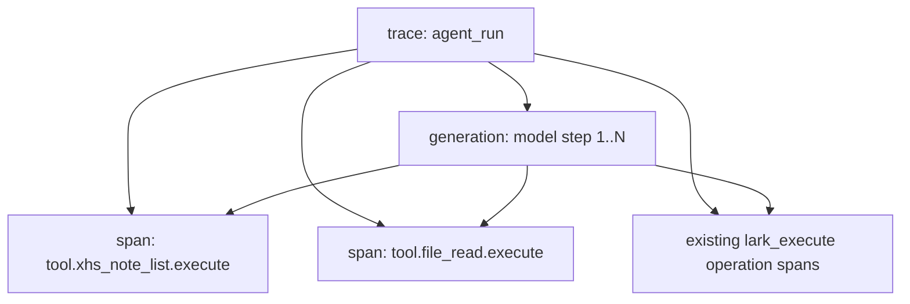

# 三 Agent 飞书内容生产流水线技术设计

> Stage: S2 · Track: Standard · Date: 2026-07-20
> Predecessor: `proposals/three-agent-feishu-pipeline-proposal.md`（S1，commit `4d144ce7`）
> 业务 Prompt SSOT: `2026-07-20-three-agent-feishu-pipeline-authoritative-prompts.md`
> Prompt SSOT SHA-256: `fc2bea1b8e05ddd285975120d0b7b401a56ed69683f90a63a4fa30f907dc66f5`

## 1. 设计结论

采用 S1 已确认的“Prompt 驱动 + 两处最小能力补齐”方案：

1. 新增一个只读平台工具 `xhs_note_list`。它只能读取当前鉴权用户的小红书选题库，单页 `limit` 最大 100；Agent 1 先用轻量索引投影发现未分析项，再按小批次读取完整内容。
2. 增强现有 `file_read`，用 UTF-8 安全的字节游标读取完整解析文本，解决 200 KiB 之后内容永久丢失的问题。
3. Agent 1 用当前用户的飞书 Base 作为分析结果 SOT 和跨运行检查点；不在有数数据库新增第二份打标结果。
4. Agent 2 把每个客户的画像卡维护为一份完整最新版的受管飞书 Doc。
5. Agent 3 在每个客户的一份受管飞书 Doc 中按轮次追加；用户明确要求修改某轮时，依靠可见、稳定的轮次标记精确替换该轮。
6. 三个 AgentDefinition 只配置到当前组织，复用现有 Builder、上传、飞书授权和 Agent runtime；不新增配置页、客户实体、公开 HTTP API 或数据库 migration。

### 1.1 被否决的方案

| 方案 | 否决原因 |
|---|---|
| 只新增 XHS 工具 | Agent 2 对大文件只能看到前 200 KiB，无法兑现“通读全部资料” |
| 100 条笔记一次返回全部正文 | 工具能力满足但上下文成本不可控；采用 `index/full` 双投影，能力上限仍为 100 |
| 后端固定工作流 + 客户/任务/目标表 | 扩大产品表面，把业务判断从 Prompt 移进代码，与已确认的 Agent 主导方式冲突 |
| 用 Base `record-batch-update` 做重分析 | 该命令会把同一 patch 写给所有 record，无法表达逐条不同分析结果 |
| Agent 3 删除旧轮次再插入 | 当前受控飞书命令目录禁止 block delete；必须使用受管标记 + `str_replace` |

## 2. 不变量与边界

### 2.1 身份与作用域

| 层级 | 权威键 | 适用数据 | 不变量 |
|---|---|---|---|
| 有数用户 | runtime 鉴权上下文中的 `current_user_id` | XHS 库、上传文件、飞书 connection、Agent 1 Base | 模型和工具参数都不能覆盖 user ID |
| 客户 | 本轮用户确认的 `customer_name` + 目标文档链接/精确标题 | Agent 2/3 文档 | 一个有数用户可连续服务很多客户；不新增内部客户表 |
| 运行 | `agent_run_id` | 本轮消息、授权恢复、工具结果、最终报告 | 每次手动触发独立；外部写入必须可核对后续跑 |

不同有数用户的飞书凭据、上传文件、XHS 数据和 Agent run 永不互相复用。客户名不是安全边界；真正的安全边界始终是当前有数用户。

### 2.2 业务边界

- Agent 1 只分析和打标，不生成选题或正文。
- Agent 2 只提炼完整客户画像，不生成选题、正文、口播稿或“深度看见”成稿。
- Agent 3 只生成选题规划，不生成完整正文、口播稿或小红书成稿。
- Agent 1 的“每次只分析一条”是判断原子性：每条独立得出结果；一次用户触发可以循环处理多条。
- 默认运行绝不重新分析 Base 中已完成记录。只有用户明确说出可验证的历史范围时才重分析。
- Agent 2/3 的客户、输入和输出目标必须来自当前对话或用户当轮确认；长期记忆只能提供便利，不能成为正确性依赖。

### 2.3 仓库与接口边界

- `numind-server`：新增 XHS tool/store 查询、增强 `file_read`、注册工具、测试和 Prompt 产品工件。
- `numind-web-v3`：预计零代码改动。现有 Agent 页面、提问卡、飞书授权卡和恢复 UI 足够。
- 不新增或修改公开 HTTP API。多仓库 API 契约明确为“现有 Agent run / ask-user / Feishu resume 接口保持字节与语义兼容”；新契约仅存在于 LLM 平台工具 Schema 内。
- 不新增数据库表、字段、索引或 migration。

## 3. 总体架构与时序


所有飞书业务动作都走现有 `lark_skill_read` + `lark_execute`：真实操作缺 scope 时由平台生成官方授权卡；授权成功后恢复同一个 run 和原 tool call。Agent 不预先让用户去设置页授权，也不读取或传递 token、connection ID、CLI HOME。

## 4. `xhs_note_list` 平台工具契约

### 4.1 工具定位

- 名称：`xhs_note_list`
- 类型：read-only / search-or-read / platform tool
- 使用方：Agent 1。Agent 2/3 的 Prompt 明确禁止把它当作已确认的 Agent 1 Base 输入。
- 当前用户：只从 `middleware.UserIDFromCtx(ctx)` 取得；Input Schema 不出现 `user_id`。
- 不读取或解释现有 `enrich_status` 和六个通用富化字段；它们不是 Prompt 1 的完成事实。

### 4.2 精确输入 Schema

```json
{
  "type": "object",
  "additionalProperties": false,
  "properties": {
    "projection": {
      "type": "string",
      "enum": ["index", "full"],
      "default": "index",
      "description": "index 仅用于发现/比对；full 返回 Prompt 1 所需原始内容"
    },
    "cursor": {
      "type": "string",
      "description": "上一页返回的不可解释游标；第一页省略"
    },
    "limit": {
      "type": "integer",
      "minimum": 1,
      "maximum": 100,
      "default": 100
    },
    "xhs_note_ids": {
      "type": "array",
      "maxItems": 100,
      "uniqueItems": true,
      "items": {"type": "string", "minLength": 1, "maxLength": 128}
    },
    "keyword": {
      "type": "string",
      "minLength": 1,
      "maxLength": 100,
      "description": "在标题和正文中匹配用户明确给出的历史范围"
    },
    "collected_from": {"type": "string", "format": "date-time"},
    "collected_to": {"type": "string", "format": "date-time"}
  }
}
```

校验规则：

- `collected_from < collected_to`，区间使用 `[from, to)`。
- `cursor` 存在时，projection 和全部过滤条件必须与第一页一致，否则返回可恢复 soft error。
- `xhs_note_ids`、keyword、时间范围可以组合，组合语义为 AND。
- 无过滤条件表示扫描当前用户完整库；这只允许用于默认“找未分析项”，不代表允许重做历史已完成项。

### 4.3 稳定游标

第一页确定快照上界和过滤指纹：

```json
{
  "v": 1,
  "after_id": 0,
  "snapshot_max_id": 98765,
  "filter_sha256": "...",
  "projection": "index"
}
```

该对象使用 canonical JSON 后做 base64url 编码。它不承担身份授权；即使被修改，所有查询仍强制带 `user_id = current_user_id`。服务端必须验证版本、数值范围、projection 和过滤指纹。

Store 新增独立方法，不改变现有用户端 offset 列表：

```sql
SELECT <projection columns>
FROM xhs_topic_note
WHERE user_id = ?
  AND id > ?
  AND id <= ?
  AND <validated filters>
ORDER BY id ASC
LIMIT limit + 1;
```

- 首次查询在同一用户和同一过滤条件下取得 `MAX(id)` 与 `COUNT(*)`。
- `limit + 1` 用于判断 `has_more`；实际返回不超过 limit。
- 运行中新增笔记的 ID 大于 `snapshot_max_id`，留到下次运行，不污染本次差集。
- 删除/更新历史行不会制造重复；初始 `snapshot_total` 只表示快照建立时的匹配数，不承诺后续仍存在。
- keyword 必须转义 `%`、`_` 和 escape 字符，不能形成任意 SQL 模式。

### 4.4 精确输出 Schema

```json
{
  "schema_version": "xhs-note-list/v1",
  "projection": "index",
  "items": [
    {
      "id": 123,
      "xhs_note_id": "abc123",
      "collected_at": "2026-07-20T08:00:00+08:00"
    }
  ],
  "snapshot_total": 243,
  "returned_count": 1,
  "has_more": true,
  "next_cursor": "...",
  "count_semantics": "stored_capture_value_presence_unknown"
}
```

`projection=full` 的 item 在 index 字段外增加：

| 字段 | 类型 | 缺失语义 |
|---|---|---|
| `note_type` | `normal | video | null` | null |
| `title` | `string | null` | null，不由工具写“信息不足” |
| `content` | `string | null` | null |
| `video_transcript` | `string | null` | null；非视频也为 null |
| `like_count` | integer | 当前库保存的采集值 |
| `collect_count` | integer | 当前库保存的采集值 |
| `comment_count` | integer | 当前库保存的采集值 |
| `comment_texts` | string[] | 仅已采集评论/一层回复文本，不含身份推断 |
| `note_url` | `string | null` | null |
| `collected_at` | `date-time | null` | null |

当前摄入模型无法区分“真实 0”和“未采集后落 0”，所以三个 count 都只能称为“库中保存的采集值”。工具和 Prompt 不得把历史 0 表述为已证明的真实 0。评论结论统一表述为“基于已采集评论”。

输入解析、鉴权缺失、游标错误和过滤错误都返回带 `error` 字段的 soft error，使模型可以纠正；数据库和基础设施错误仍返回 Go error 并进入运行失败语义。

### 4.5 调用策略

Agent 1 默认：

1. `projection=index, limit=100` 分页取得业务键；
2. 与 Base 的 `小红书笔记ID + 分析状态` 做差集；
3. 对差集按正文体量分组，通常每组 5-10 条，用 `projection=full, xhs_note_ids=[...]` 读取；
4. 每条独立分析，最多 20 条组成一次 Base create batch。

5-10 和 20 都是运行/写入工作批次，不是 XHS 工具能力上限。工具任何投影的 `limit` 上限仍为 100。

## 5. `file_read` 可续读契约

### 5.1 兼容输入 Schema

现有 `file_url` 和 `prompt` 保持不变，新增：

```json
{
  "offset": {
    "type": "integer",
    "minimum": 0,
    "default": 0,
    "description": "规范化解析文本的 UTF-8 字节偏移"
  },
  "limit_bytes": {
    "type": "integer",
    "minimum": 1,
    "maximum": 65536,
    "default": 65536
  },
  "read_token": {
    "type": "string",
    "description": "续页时回传上一页的内容指纹，防止文件变化后拼接错位"
  }
}
```

`file_url` 仍只能是当前用户的 `/agent-attachments/<userID>/` 或 `/agent-outputs/<userID>/` URL。跨用户访问继续返回 soft error。

### 5.2 解析和分页

1. PDF/Word/Excel/PowerPoint/RTF 下载上限保持 20 MiB，完整解析，不在 parser 内截断到 200 KiB。
2. text/markdown 下载上限改为 20 MiB + 1；超过上限返回明确错误，不静默截断。
3. OCR 获取完整响应文本。
4. 所有 parser 输出先用 `strings.ToValidUTF8` 规范化，再计算 `read_token = sha256(normalized_content)`。
5. 续页传入的 `read_token` 与本次解析结果不一致时拒绝拼接，要求从 offset 0 重读。
6. `offset` 必须位于 UTF-8 rune 边界；非法人工偏移返回 soft error。end 从 `offset + limit_bytes` 向前收缩到 rune 边界，`next_offset=end`，不重叠也不漏字节。
7. `offset == content_bytes` 返回空 content、`has_more=false`；`offset > content_bytes` 返回 soft error。

### 5.3 输出

```json
{
  "file_name": "客户资料.pdf",
  "mime_type": "application/pdf",
  "content": "本页规范化文本……",
  "page_count": 0,
  "byte_size": 1048576,
  "content_byte_size": 312004,
  "offset": 65530,
  "returned_bytes": 65528,
  "next_offset": 131058,
  "has_more": true,
  "read_token": "sha256:...",
  "truncated": true
}
```

- `byte_size` 继续表示源文件大小；`content_byte_size` 表示规范化后的解析文本大小。
- 为向后兼容保留 `truncated`，其值等于 `has_more`；新 Prompt 只依赖 `has_more/next_offset/read_token`。
- V2 runtime 对可信内置 `file_read` 使用专用 bounded-atomic wrapper：完整 JSON envelope 上限 384 KiB，在限额内直接交给模型，不再被通用 16 KiB artifact preview 二次截断；超过硬限返回 soft error。其他工具的 artifact 行为不变。
- Agent 2 只有在每个来源都读到 `has_more=false` 后才能声称“已通读”。到达运行步数上限时必须报告尚未读完的文件和 offset，不能生成伪完整画像。

## 6. 统一飞书目标解析与授权

### 6.1 目标解析顺序

每个输出目标按下列顺序解析：

1. 本轮用户明确提供的飞书链接；
2. 当前对话中用户已经确认的链接或精确文件名；
3. 都没有时调用 `ask_user_question`，询问“保存到哪个飞书文件、精确文件名是什么”。可以给出标准名建议，但不能替用户确认；
4. 对用户确认的名称搜索当前用户飞书；
5. 精确结果 0 个则按确认名称创建，1 个则复用，>1 个则请用户给链接或选择；
6. 搜索不完整、类型冲突或 schema 冲突时同样不能猜。

标准名仅作为问题中的建议：

- Agent 1：`小红书爆款素材库`
- Agent 2：`【客户名称】客户核心信息与人群画像卡`
- Agent 3：`【客户名称】选题规划`

### 6.2 精确搜索

- Base：`drive +search --only-title --doc-types bitable --page-size 20`。
- Doc：`drive +search --only-title --doc-types docx --page-size 20`。
- `--query` 最长 30 Unicode code points。精确标题超过 30 时用不超过 30 字的客户名/标题核心做召回，再在客户端剥离 `<h>/<hb>` 后按完整标题严格相等过滤。
- 最多翻 5 页并按 token/URL 去重。第 5 页仍 `has_more=true` 且尚不能证明唯一性时，不把当前集合宣称为全量，改为要求用户提供链接。
- 用户直接提供 Wiki 链接可由 Docs fetch 解析；自动创建的目标始终是 docx，不自动创建 Wiki 节点。

### 6.3 授权与恢复

- Agent 先执行真实业务命令，由平台做 scope preflight。
- 未授权时现有平台创建绑定当前 user/app/device/operation/run/tool-call 的授权卡。
- 用户完成官方授权后恢复原 tool call；Agent 不让用户重新发起任务。
- write-like 操作返回 `unknown` 时绝不盲重放。Agent 先重新读取目标，按业务键/受管标记核对；无法确认则停止并报告。

## 7. Agent 1：爆款素材加工打标

### 7.1 目标 Base schema

第一字段 `小红书笔记ID` 是业务键。创建 Base 时用一次 `base +base-create --name ... --table-name "爆款素材" --fields ...` 建立字段；复用 Base 时先列字段，缺字段且无同名类型冲突可自动补齐，同名类型冲突则询问用户提供另一个 Base 或允许修复。

| # | 字段名 | Base 类型 | 规则 |
|---:|---|---|---|
| 1 | 小红书笔记ID | `text` | 第一字段；幂等业务键 |
| 2 | 有数笔记ID | `number`，precision 0 | 内部定位，不作为跨系统主键 |
| 3 | 笔记类型 | `select` 单选 | 图文 / 视频 / 信息不足 |
| 4 | 笔记标题 | `text` | 缺失写“信息不足” |
| 5 | 笔记正文 | `text` | 缺失写“信息不足” |
| 6 | 视频文字稿 | `text` | 缺失或不适用写“信息不足” |
| 7 | 点赞数 | `number`，precision 0 | 库中保存的采集值 |
| 8 | 收藏数 | `number`，precision 0 | 同上 |
| 9 | 评论数 | `number`，precision 0 | 同上 |
| 10 | 评论区文本 | `text` | 仅已采集评论；无则“信息不足” |
| 11 | 原文链接 | `text` + `style.url` | 缺失写“未提供” |
| 12 | 采集时间 | `datetime` | 缺失留空 |
| 13 | 达标判定 | `select` 单选 | 达标 / 部分达标 / 不达标 |
| 14 | 判定说明 | `text` | 有证据的一句话，不只凭数据大小 |
| 15 | 原生赛道 | `text` | 内容本身赛道 |
| 16 | 适配赛道 | `select` 多选 | 房产 / 留学 / 移民 / 保险 / 求职 / 雅思 |
| 17 | 人群画像 | `text` | 写到资料能支持的具体处境 |
| 18 | 标题钩子 | `text` | 爆款结构 1/5 |
| 19 | 开头留人 | `text` | 爆款结构 2/5 |
| 20 | 正文结构 | `text` | 爆款结构 3/5 |
| 21 | 情绪调动点 | `text` | 爆款结构 4/5 |
| 22 | 结尾CTA | `text` | 爆款结构 5/5 |
| 23 | 主语身份 | `select` 单选 | 自己 / 客户 / 第三方 / 泛人称 |
| 24 | 六大类标签 | `select` 多选 | Prompt 1 六大类固定名 |
| 25 | 子类标签 | `select` 多选 | Prompt 1 固定子类；垂直人群泛话题可用对应大类名 |
| 26 | 能否跨赛道 | `select` 单选 | 能 / 部分能 / 不能 |
| 27 | 跨赛道理由 | `text` | 一句话证据 |
| 28 | 可借鉴部分 | `text` | 可复用的钩子/结构/表达/情绪/判断方式 |
| 29 | 不可照搬部分 | `text` | 行业事实、人物、事件、政策、特殊资源等边界 |
| 30 | 推导链 | `text` | 一句话串联整体判断 |
| 31 | 分析状态 | `select` 单选 | 已完成 / 失败待重试 |
| 32 | 分析完成时间 | `datetime` | 成功写入时间 |
| 33 | 分析规则版本 | `text` | Agent 1 Prompt version/hash |
| 34 | 有数契约版本 | `text` | 固定 `xhs-viral-base/v1` |

字段创建 JSON 只使用飞书当前 SSOT 支持的 `type/name/style/multiple/options/description`，不使用旧 `field_name/property/ui_type` 或数字 type。

### 7.2 默认扫描算法

```text
resolve confirmed Base
→ validate/reconcile schema
→ page Base fields [小红书笔记ID, 分析状态, 分析规则版本]
→ build map xhs_note_id -> []record
→ page xhs_note_list(index, limit=100) over stable snapshot
→ classify each ID:
   0 Base rows                     = new/unanalysed
   1 row + status=已完成            = skip
   1 row + status!=已完成           = resume/update same record
   >1 rows                         = anomaly, do not write automatically
→ fetch full notes in content-sized batches
→ analyze exactly one note at a time
→ create new rows in batches <=20; update incomplete rows one by one
→ report processed/skipped/anomaly/failed/remaining
```

Base record listing用 `page_size=100`，只投影所需字段并翻到 `has_more=false`。运行中任何一批成功写入就是续跑检查点。

### 7.3 新记录与重分析写入

- 新记录：使用 `base +record-batch-create`；每行包含自己的完整 raw + analysis + checkpoint 字段，最多 20 行一批。
- 已存在但未完成：使用 `base +record-upsert --record-id <id>` 更新同一行。
- 显式历史重分析：用户必须给出笔记 ID/链接、关键词、采集时间范围或其他可验证范围。Agent 先定位唯一 Base record，再对每条执行独立 `record-upsert --record-id`。
- 禁止用 `record-batch-update` 更新不同分析结果，因为它只支持把同一 patch 应用给所有 record ID。
- 重分析范围模糊时询问，不能扩大为全库。
- 同一 XHS ID 在 Base 有多行时不自动选“最新”或覆盖；列出异常并请用户处理。

### 7.4 完成与未知写入

- 只有 Base 成功写入包含 `分析状态=已完成` 的完整行，才算该笔记完成。
- 不在有数 XHS 表写 `mark_analyzed`，不把“模型已生成”当完成。
- write 成功响应：记录 checkpoint，继续下一批。
- write `unknown`：停止该批盲重试，重新读取 Base 并按 XHS ID 检查。唯一完整已完成行表示已落地；0 行表示仍未知并报告；多行进入异常。
- Agent run 达到步数/上下文上限：如实报告 remaining；下次运行自动由 Base 差集继续。

### 7.5 并发语义

v1 不新增用户级租约。产品语义要求同一用户不要同时启动两个 Agent 1 run。Base 没有唯一约束，因此真正并发的“都先读不到再 create”仍可能重复。Prompt 会提示检测并发/重复，但不声称绝对互斥；真实使用若出现并发需求，另开 feature 增加平台级用户租约。

## 8. Agent 2：客户核心信息与人群画像提炼

### 8.1 输入和完整性

必需：

- 用户确认的客户名称；缺失时询问，不从资料标题猜成最终客户名。
- 至少一份上传资料或飞书资料；两类可以混合。
- 当前对话确认的目标文档链接/精确名称；缺失时询问。

每份来源在工作记录中保留：标题/文件名、链接或附件标识、来源类别（一手/第三方/半成品）、读取完整性。上传文件必须经 `file_read` 读到 `has_more=false`；飞书文档按 full/range 分段读完整。未读完不得进入“已通读”清单。

账号阶段缺失固定按 0-1；不从资料推断。Agent 2 不使用蓝 V。

### 8.2 输出结构

完整文档严格保留 Prompt 2 七个一级模块：

1. 资料来源判断；
2. 账号定位素材；
3. 核心人群画像；
4. 向内求素材库；
5. 第三方素材说明；
6. 深度看见候选点；
7. 资料缺口清单。

所有确定判断带可追溯来源；第三方只佐证，半成品不照抄。再次运行必须先读取旧画像卡和新增资料，再生成一份完整最新版，而不是只追加 diff。

### 8.3 受管文档协议

新建文档正文首尾带稳定可见标记：

```text
[有数AI受管区：客户画像｜契约 profile/v1｜开始]
# 客户核心信息与人群画像卡
客户：<customer_name>
本次更新：<RFC3339 time>
……完整七模块……
[有数AI受管区：客户画像｜契约 profile/v1｜结束]
```

- 精确匹配到带该开始/结束标记的文档：完整 fetch，合成最新版后用 Docs `overwrite` 更新全文。
- 用户直接链接并明确要求写入一个无标记文档：先说明会整体更新并询问确认；不得静默覆盖。
- 精确搜索命中无标记的同名文档：询问是接管该文档还是换名创建。
- 标记不成对或出现多组：视为文档损坏/歧义，不 overwrite。
- overwrite unknown：重新 fetch，只有新版本 marker 和本次更新时间/内容证据一致才视为成功；否则报告未知。

该文档是 Agent 2 产物的完整最新版；受管标记不是用户配置功能，只是安全更新协议。

## 9. Agent 3：选题规划

### 9.1 输入门禁

必须获得：

- 用户确认的客户名称；
- Agent 2 客户画像卡（上传或当前用户飞书）；
- Agent 1 爆款素材库（上传或当前用户飞书 Base）；
- 目标选题文档链接/精确名称；缺失时询问。

可选输入及默认：账号阶段缺失为 0-1；蓝 V 缺失按“否/未提供”；目标条数缺失为 70；上一轮反馈有则先形成本轮规避重点。

Agent 3 不允许绕过 Agent 1 产物而直接调用 `xhs_note_list` 假装素材已打标；也不能凭聊天印象或模型常识替代画像卡/Base。

### 9.2 来源准入

| Base 状态 | 正式使用规则 |
|---|---|
| 达标 | 优先候选，可按字段完整性进入正式选题 |
| 部分达标 | 可用，但必须标“仅借局部手法”，遵守可借鉴/不可照搬字段 |
| 不达标 | 禁止作为正式来源 |
| 缺达标/标签/跨赛道/链接 | 进入待确认，不计正式数量 |

客户事实、经历、案例、评价、结果和观点只能来自画像卡。爆款 Base 只提供结构、打法和带链接的参考。

### 9.3 每条正式选题九字段

1. 选题内容；
2. 选择原因；
3. 归属小类；
4. 生成路径（向内求 / 向外求）；
5. 推导链；
6. 参考来源链接；
7. 参考类型；
8. 变形说明；
9. 主语自检。

除 Prompt 3 明确允许“硬广-好评型独立生成”的例外外，正式选题必须带有效来源链接。向内求借用爆款结构时也必须填链接并标“仅参考结构”。非蓝 V/未知蓝 V 不生成任何硬广营销类；0-1 阶段人设主语必须是创始人/顾问本人。资料不足允许少于 70，必须在数量统计和待确认清单解释，禁止凑数。

### 9.4 受管文档和轮次

文档头：

```text
[有数AI受管文档：选题规划｜契约 topics/v1]
# <customer_name> 选题规划
```

每轮生成一个在写入前确定、同一 run 内保持不变的 `round_id`（UTC timestamp + 6 位随机十六进制），并使用稳定标记：

```text
[有数AI轮次：R20260720T083000Z-a1b2c3｜第 3 轮｜开始]
## 第 3 轮｜2026-07-20｜0-1｜蓝V：否/未提供
……本轮规避重点、六大类、数量统计、待确认清单……
[有数AI轮次：R20260720T083000Z-a1b2c3｜第 3 轮｜结束]
```

新一轮：

1. full fetch 目标文档；
2. 验证受管文档头和已有轮次标记成对、round ID 唯一；
3. `N = max(existing N) + 1`；
4. 用 Docs `append` 一次追加完整轮次块；
5. write unknown 时重新 fetch 并查同一 round ID，存在且标记成对才视为成功。

修改指定轮次：

1. 用户必须明确指出第 N 轮或唯一 round ID；“改上一轮”若上下文不能唯一确定就询问。
2. full fetch 后定位唯一 begin/end block。
3. 保持原 round ID 和轮次号，生成完整替代 block。
4. 用 Docs Markdown `str_replace` 把旧 block 精确替换成新 block。
5. 如果命令 payload 超限，但整个文档有受管文档头且所有轮次标记完整，可以在完整重建后 `overwrite`；否则停止并询问，不能删除/覆盖用户非受管内容。

当前受控目录禁止 block delete，所以设计不依赖删除块。无标记同名文档的处理与 Agent 2 一致：不能静默接管。

## 10. 最终 AgentDefinition Prompt 组装

### 10.1 权威业务文本

用户提供的三份完整 Prompt 已原样入库：

- Prompt 1：SSOT 第 1-454 行；
- Prompt 2：SSOT 第 455-935 行；
- Prompt 3：SSOT 第 936-1531 行。

配置前必须校验文件 SHA-256 与文首值一致。业务分类、六大类、子类、账号阶段、蓝 V、向内/向外、数量分配和禁止事项均不得改写。

### 10.2 组成公式

每个最终 `AgentDefinition.system_prompt` 按以下确定性公式生成：

```text
<对应 Agent 的运行契约前言>
\n\n--- 以下为不可删改的业务判断规则 ---\n\n
<SSOT 中对应 Prompt 的完整原文>
<两处指定模板补丁，其他零修改>
```

运行契约前言必须完整包含本 spec 对该 Agent 的：触发语义、输入门禁、目标解析、飞书授权恢复、读写时序、幂等/未知写入、最终统计、禁止越界。它是执行编排规则；SSOT 原文是业务判断规则。两者冲突时，平台/租户安全规则最高，其次是本 spec 的数据与写入契约，业务判断仍以 SSOT 为准。

### 10.3 两处且仅两处业务模板补丁

1. Prompt 1 的输出两列表格在“跨赛道理由”后、“推导链”前增加：

```markdown
| 可借鉴部分 | 后续可以复用的钩子、结构、表达、情绪或判断方式 |
| 不可照搬部分 | 不能复用的行业事实、人物、事件、政策或特殊资源 |
```

2. Prompt 3 的具体 `#### 选题 N` 模板在“选题内容”后增加：

```markdown
- 选择原因：用一句话说明为什么适合该客户
```

原 Prompt 3 的“每条选题必须包含”已经要求选择原因，本补丁只是修正具体模板遗漏。

### 10.4 当前组织配置

- 通过现有 Agent Builder/API 在当前组织创建或更新三个 AgentDefinition，不修改 `skill_template`，不自动下发给其他组织。
- 名称建议：`爆款素材加工打标`、`客户核心信息与人群画像提炼`、`选题规划`。
- `system_prompt` 保存完整合成结果并形成版本历史；Prompt 1 hash 写入 Base `分析规则版本`。
- 工具 flags 按最小需要配置。即使 full-open runtime 当前会提供更多平台工具，Prompt 仍明确禁止跨角色调用；本 feature 不顺带重构全平台 tool visibility。
- 配置后的 AgentDefinition ID、版本 ID、Prompt hash 只记录到 S5 QA/验收工件，不硬编码进源代码。

## 11. 错误、恢复与最终报告

### 11.1 统一错误语义

| 情况 | 行为 |
|---|---|
| 缺客户/目标/输入 | `ask_user_question`，保留 run |
| 飞书未授权/缺 scope | 官方授权卡，成功后恢复原 tool call |
| 飞书精确匹配 >1 | 要链接/选择，不猜 |
| XHS 游标/过滤输入错误 | soft error，模型修正参数 |
| 上传读取未完成 | 继续 offset；不能宣称通读 |
| write failed | 报告失败，可按明确错误修正后重试 |
| write unknown | 不重放；先读目标按业务键/marker 核对 |
| Base 重复业务键/Doc marker 损坏 | 排除自动写入，报告异常并询问 |
| run 步数耗尽 | 报告已完成和 remaining；利用 Base/Doc checkpoint 续跑 |

### 11.2 Agent 1 最终报告

必须包含：快照匹配总数、已处理、新建、更新、默认跳过、重复异常、失败、剩余；显式重分析时还要复述范围。不能用“已开始”代替“已完成”。

### 11.3 Agent 2 最终报告

必须包含：客户名、已完整读取来源数、未读完/失败来源、目标 Doc 链接、create/update 模式、资料缺口。若来源未读完，不得声称已生成完整最新版。

### 11.4 Agent 3 最终报告

必须包含：客户名、正式选题数、各大类数量、待确认数、蓝 V/账号阶段采用值、目标 Doc 链接、append/replace-round 模式和 round ID。

## 12. Trace topology 与隐私

本 feature 不新增专用 LLM 调用；沿用 Agent ReAct 主链。



| 节点 | 允许 metadata | 禁止 metadata |
|---|---|---|
| trace root | run ID、AgentDefinition ID、内部 user ID | 客户资料正文、飞书 token |
| model generation | 沿用现有受控输入/输出策略 | 新增明文副本 |
| XHS span | projection、过滤类型、limit、returned_count、has_more、duration | 标题、正文、评论、URL |
| file_read span | MIME、offset、limit、returned_bytes、has_more、duration | 文件正文、URL query、read token |
| lark operation | 现有安全 observation | CLI HOME、token、stdin、文档/Base 内容 |

Agent 1 运行结束记录 processed/skipped/remaining/failed 数量；Agent 2/3 记录 source_count 和 output_mode。若现有 trace API 没有可靠 final-run metadata 写入口，先记录为结构化应用日志并在 S3 单列实现任务，不把敏感正文塞入 trace。

## 13. 测试设计

### 13.1 XHS 工具和 store

- Input Schema 不含 `user_id`，limit 1/100 成功，0/101 soft error。
- 用户 A/B 各有数据时，A 的 context 永远看不到 B。
- 101/243 条记录按 ID 升序分页，无重复无遗漏。
- 第一页后插入新记录不会进入本快照；下次新快照可见。
- projection index 不返回正文；full 返回 Prompt 1 全部输入字段。
- xhs_note_ids/keyword/时间范围及组合过滤正确；LIKE 字符安全转义。
- cursor 换 projection/filters、损坏版本、负数 ID 都可恢复报错。
- 0 与 presence unknown、评论有限样本语义在输出契约中存在。

### 13.2 file_read

- 现有 PDF/Word/xlsx/pptx/RTF/image/text 正常场景回归。
- 当前用户 ownership 通过，跨用户拒绝。
- 300 KiB 以上中英文混排内容用多次 offset 完整重组，SHA-256 等于原规范化文本。
- chunk end 落在 2/3/4-byte rune 中间时向前收缩，重组无乱码、无重复、无缺失。
- 人工非法 offset、offset 越界、read_token 不匹配均 soft error。
- exactly 64 KiB、64 KiB+1、20 MiB 上限边界。
- trusted file_read envelope 不被通用 artifact preview 截断；超 384 KiB 防御生效。

### 13.3 Agent 1 编排

- fake tools 验证先 Base scan、再 XHS index、再 full batch、再 Base write。
- >100 未分析项能翻页；第二次默认运行全跳过；新增一条只处理新增。
- Base 单条未完成用 record-upsert；显式范围重分析逐条 upsert；不同结果不调用 batch-update。
- 重复 XHS ID、unknown write、部分批次成功、run 中断都按契约报告/续跑。
- Prompt snapshot 包含 SSOT、可借鉴/不可照搬补丁、禁止选题/正文和自动扫描语义。

### 13.4 Agent 2/3 编排

- 上传、飞书、混合来源都可用；未读完来源不进入完整输出。
- 目标 0/1/>1 和未授权恢复序列正确。
- Agent 2 create、managed overwrite、unmanaged collision、marker 损坏。
- Agent 3 append 新 round、精确 replace 指定 round、unknown 后 marker 对账、无标记文档不接管。
- 非蓝 V/未知不产生硬广；0-1 人设主语正确；达标/部分达标/不达标准入正确。
- 每条选题九字段齐全，资料不足不凑 70。

### 13.5 回归和 Dev 验收

- `go test ./...`、相关 package race、`task lint`。
- 现有 Agent run、ask-user、file_read、Feishu authorization/resume、Base/Docs tests 全部通过。
- `numind-web-v3` 无 source diff；仍跑 `npm run lint && npm run type-check` 证明接口零回归。
- Dev 用当前组织三个真实 AgentDefinition 依次验证：新授权 Agent 1、同 Base 续跑、Agent 2 新/老客户、Agent 3 append/replace round。
- Langfuse/安全日志只出现允许 metadata，不出现正文、评论或 token。

## 14. PRD / AC 覆盖自检

| S1 AC | 设计覆盖 |
|---|---|
| AC-1/2 XHS 100 + 隔离 | §4.2-4.4、§13.1 |
| AC-3/4 Base 目标 + 授权恢复 | §6、§7.1 |
| AC-5 Base 完整字段 | §7.1、§10.3 |
| AC-6/7 分页、续跑、默认跳过 | §4.3、§7.2-7.4 |
| AC-8 显式范围重分析 | §7.3 |
| AC-9 不达标禁用 | §9.2 |
| AC-10 大文件全读 | §5、§8.1 |
| AC-11/12 Agent 2 新建复用 + 七模块 | §8.2-8.3 |
| AC-13/14 Agent 2 阶段/禁令 | §8.1-8.2、§2.2 |
| AC-15 Agent 3 双输入路径 | §9.1 |
| AC-16 来源准入 | §9.2 |
| AC-17 蓝 V/0-1 | §9.3 |
| AC-18 九字段 | §9.3、§10.3 |
| AC-19 create/append/replace | §9.4 |
| AC-20 不凑数 | §9.3 |
| AC-21/22 回归与质量门 | §13.5 |
| AC-23 trace | §12 |
| AC-24 三 Prompt/角色隔离 | §10、§13.3-13.4 |

覆盖结论：S1 的 24 项 AC 和三个 Prompt 的角色、输入、执行流程、输出与禁止事项均有设计落点；没有新增产品 UI，也没有把用户/客户特定飞书信息写死进 Prompt。

## 15. 预计文件面与实施顺序约束

预计后端文件面（S3 再锁定精确 task）：

- `internal/numind/store/xhs_topic.go`：新增 keyset snapshot query；
- `internal/numind/biz/agent/tool_xhs_note_list.go` + tests；
- `internal/numind/biz/agent/factory_platform.go`：注册工具；
- `internal/numind/biz/agent/tool_file_read.go`、`file_read_parsers.go` + tests；
- `internal/numind/biz/agent/runner_v2_artifact.go` + tests：可信 file_read bounded atomic；
- 版本化 Prompt 工件/配置脚本和 Agent 编排 contract tests；
- 本 design、S3 plan、S5 QA 工件。

实施必须先完成后端工具契约和 RED/GREEN 测试，再配置真实 AgentDefinition，最后做飞书 Dev 验收。`numind-web-v3` 在没有发现实际兼容问题前不得制造无意义改动。

## 16. S2 Gate

- [x] 已比较替代方案并锁定推荐方向。
- [x] 已定义多仓库接口边界（无新 HTTP API；工具 Schema 为新增契约）。
- [x] 已定义 XHS、file_read、Base、Doc 和 Prompt 精确契约。
- [x] 已覆盖 S1 全部用户故事与 24 项 AC。
- [x] 已定义 LLM trace topology 和敏感信息边界。
- [x] 已将用户提供的三份完整 Prompt 原样纳入仓库并锁定 SHA-256。
- [x] 已完成设计自检；下一步等待产品负责人确认本 S2 设计后进入 S3。
